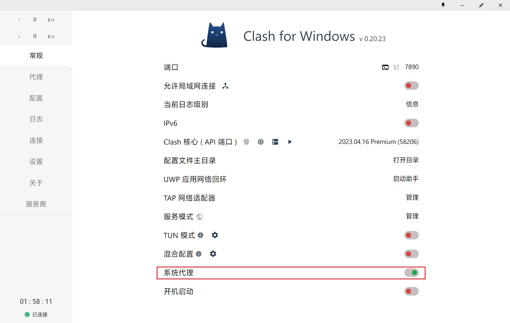
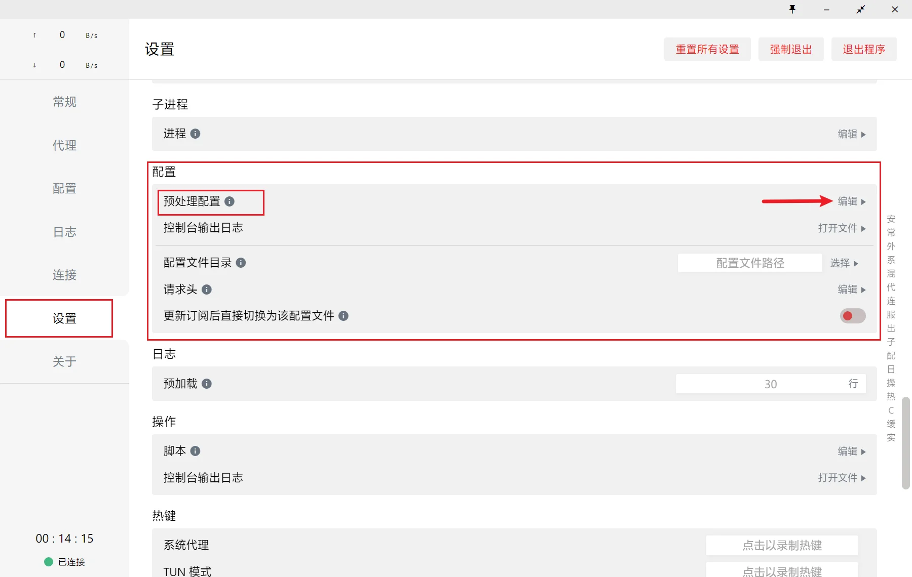
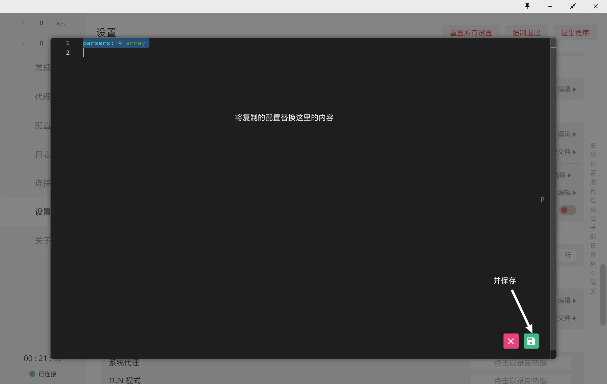
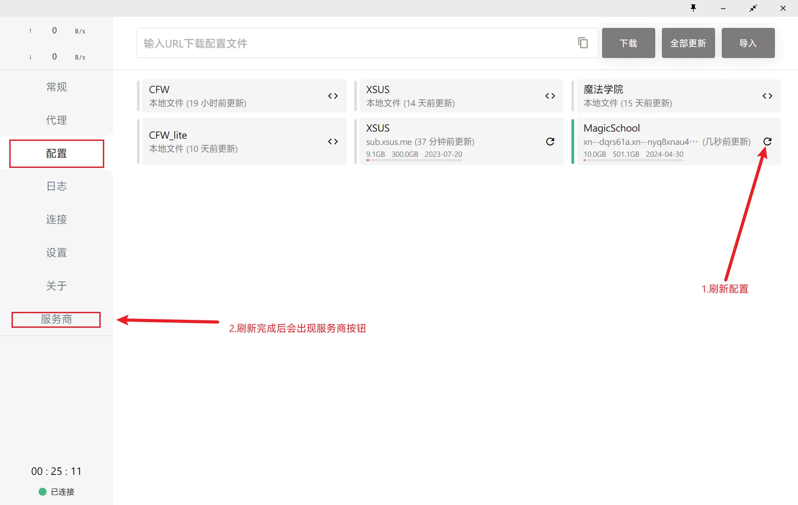

# Clash for Windows 预处理配置使用方法

<!-- prettier-ignore -->
!!! 注意
    由于 CFW 所使用的 Clash Premium 内核并不支持解析Base64格式的订阅，因此此处仅展示在本地直接覆盖机场配置的预处理；

    CFW 本地配置请自行在仓库中自行寻找并参考上文所述方法修改对应的参数。

1.导入订阅后，确保正常链接外网，启动系统代理

2.打开CFW 设置——配置——点击预处理右侧的编辑，会弹出一个编辑器

3.点击下面链接自动复制配置，在 CFW 弹出的编辑器里，替换原有内容，并保存

<a id="copyLink" href="https://gitlab.com/Nessk/vpn/-/raw/main/Clash/Premium/CFW_parser.yaml">点击自动复制文件内容（不支持iOS）</a>

4.打开CFW 配置，刷新配置，等待下载外部文件

<!-- prettier-ignore -->
!!! 注意
    CFW无法通过代理拉取资源，如果出现下载失败的错误，多试几次就好

