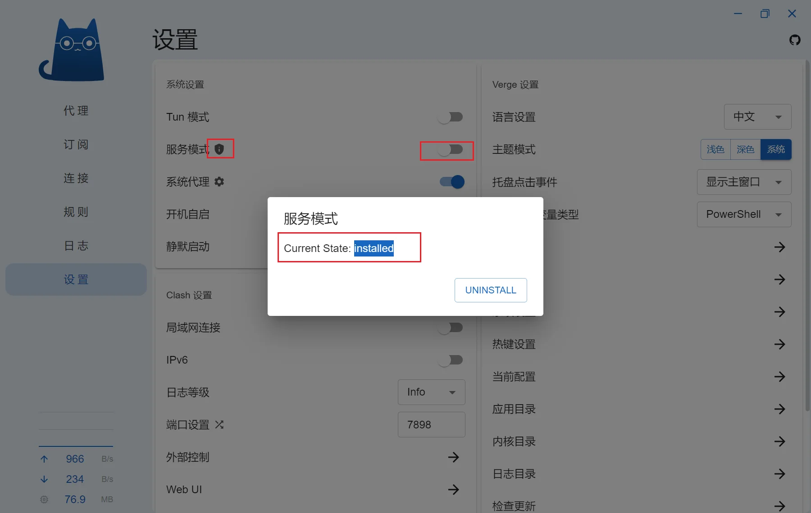

### 解除UWP应用回环限制

* 应用目录的`resources文件夹`下双击运行 `enableLoopback.exe`
* 全选软件(Ctrl+A)，勾选前方任意选项框，点击工具栏的 **Save Changes**


### 设置 TUN 模式

<!-- prettier-ignore -->
!!! 提示
    由于部分软件并不使用系统代理，因此需要设置TUN模式强制接管这些流量，比如Emby客户端

* 点击左侧 **设置** ，点击 **服务模式** 右边的盾牌🛡 → 点击 **INSTALL**，

* 安装完成后，勾选 **服务模式** 右侧的选项，勾选 **TUN 模式** ，并取消勾选 **系统代理**

* 如果此前其他ClashVerge安装过 **服务模式**，需要在应用目录的`resources文件夹`下双击运行 `uninstall-service.exe` 后，再进行上方的安装步骤





### 添加多个机场订阅

可以按照如下格式将策略组填写在`proxy-providers`下方

!!! 注意
    `proxy-provider` 的名称前面有两个空格，不要使用 Tab 进行缩进，使用英文`,` ，符号后有空格


```yaml
p: &p {type: http, interval: 86400, health-check: {enable: true, url: http://connectivitycheck.gstatic.com/generate_204, interval: 1800, timeout: 5000}}
proxy-providers:
  Subscribe: # 在此将 "http://your-service-provider" 替换为你的机场订阅，推荐使用 base64 或者 node list
    url: http://your-service-provider
    <<: *p
    #override: # 修改节点前后缀时，需移除前方的 "#" 符号
      #additional-prefix: "节点前缀"
      #additional-suffix: "节点后缀"
  #Subscribe2: {url: http://your-service-provider, <<: *p}
```

👇 移除 `Subscribe2` 前方的 `#`，并修改对应的 `http://your-service-provider` 即可。

```yaml
p: &p {type: http, interval: 86400, health-check: {enable: true, url: http://connectivitycheck.gstatic.com/generate_204, interval: 1800, timeout: 5000}}
proxy-providers:
  Subscribe: # 在此将 "http://your-service-provider" 替换为你的机场订阅，推荐使用 base64 或者 node list
    url: http://your-service-provider
    <<: *p
    #override: # 修改节点前后缀时，需移除前方的 "#" 符号
      #additional-prefix: "节点前缀"
      #additional-suffix: "节点后缀"
  Subscribe2: {url: http://your-service-provider, <<: *p}
```


### 机场节点添加前缀/后缀

Mihomo 支持在 `proxy-providers` 中使用 [`override`](https://wiki.metacubex.one/config/proxy-providers/#override) 对节点名称前后缀进行修改

eg:

```yaml
p: &p {type: http, interval: 86400, health-check: {enable: true, url: http://connectivitycheck.gstatic.com/generate_204, interval: 1800, timeout: 5000}}
proxy-providers:
  Subscribe: # 在此将 "http://your-service-provider" 替换为你的机场订阅，推荐使用 base64 或者 node list
    url: http://your-service-provider
    <<: *p
    #override: # 修改节点前后缀时，需移除前方的 "#" 符号
      #additional-prefix: "节点前缀"
      #additional-suffix: "节点后缀"
```

👇 删除对应的 `#`

```yaml
p: &p {type: http, interval: 86400, health-check: {enable: true, url: http://connectivitycheck.gstatic.com/generate_204, interval: 1800, timeout: 5000}}
proxy-providers:
  Subscribe: # 在此将 "http://your-service-provider" 替换为你的机场订阅，推荐使用 base64 或者 node list
    url: http://your-service-provider
    <<: *p
    override: # 修改节点前后缀时，需移除前方的 "#" 符号
      additional-prefix: "节点前缀"
      additional-suffix: "节点后缀"
```


### 修改策略组类型

默认地区/国家策略组，全部为自动选择最低延迟，测试地址为：`http://connectivitycheck.gstatic.com/generate_204` , 测试间隔：1800 秒

* 点击左侧 **配置/订阅** → 找到使用的配置并右键 → **修改配置**
* 找到第140行 `- {name: 🇭🇰 香港节点, <<: *auto, filter: ...."}`，将 `*auto` 修改为 `*select`；

<!-- prettier-ignore -->
!!! 注意
    修改后的 `<<: *select` 中的 `*` 前面有空格

- `自动选择`策略组对应 `*auto`
- `手动选择`策略组对应 `*select`
- `故障回退`策略组对应 `*fallback`
- `负载均衡`策略组对应 `*load-balance`

eg:

```yaml
proxy-groups:
...

  - {name: 🇭🇰 香港节点, <<: *auto, filter: "^(?=.*((?i)🇭🇰|香港|(\b(HK|Hong)\b)))(?!.*((?i)回国|校园|游戏|(\b(GAME)\b))).*$"}
```

👇

```yaml
proxy-groups:
...

  - {name: 🇭🇰 香港节点, <<: *select, filter: "^(?=.*((?i)🇭🇰|香港|(\b(HK|Hong)\b)))(?!.*((?i)回国|校园|游戏|(\b(GAME)\b))).*$"}
```


### 添加策略组


如果需要添加**筛选节点用的地区/国家策略组**，可以按照如下格式将策略组填写在`proxy-groups`下方

<!-- prettier-ignore -->
!!! 注意
    符合前面有两个空格，最好不要使用Tab进行缩进，使用英文符号，符号后有空格

eg:

```yaml
proxy-groups:
...

  - {name: 地区策略组名称1, <<: *auto, filter: "正则表达式"}

  - {name: 地区策略组名称2, <<: *select, filter: "正则表达式"}

  - {name: 地区策略组名称3, <<: *fallback, filter: "正则表达式"}
```

并且需要在 第`77`行 添加 **对应的策略组名称**

这样所有策略组中带有`*pg`的策略组都会添加此策略组

eg:

```yaml
pg: &pg {type: select, proxies: [🚀 手动切换, 🇭🇰 香港节点, 🇺🇸 美国节点, 🇸🇬 狮城节点, 🇯🇵 日本节点,  🇨🇳 台湾节点, ♻️ 自动选择, ⚠️ 故障转移, DIRECT]}
```

👇 

```yaml
...
pg: &pg {type: select, proxies: [🚀 手动切换, 🇭🇰 香港节点, 🇺🇸 美国节点, 🇸🇬 狮城节点, 🇯🇵 日本节点,  🇨🇳 台湾节点, 地区策略组名称1, ♻️ 自动选择, ⚠️ 故障转移, DIRECT]}
```

---

如果需要自定义**策略组需要包含哪些策略组**，可以按照如下格式将策略组填写在`proxy-groups`下方

!!! 注意
    - 符合前面有两个空格，最好不要使用 Tab 进行缩进，使用英文符号，符合后有空格

```yaml
proxy-groups:
...

  - {name: 📺 哔哩哔哩, type: select, proxies: [DIRECT, 🇭🇰 香港节点, 🇨🇳 台湾节点]}
```

---

如果希望某个策略组包含某个机场(proxy-providers)的所有节点，或者对其单独筛选，可以按照如下格式将策略组填写在`proxy-groups`下方

- `use: [Subscribe]`：表示该策略组将包含这个`proxy-provider`的所有节点，`[Subscribe]`必须是`proxy-providers`中存在的；可以写多个，例如`[Subscribe1, Subscribe2, Subscribe3]`

- 如果后面写上`filter: "正则表达式"`，则将会对`Subscribe`这个`proxy-provider`的节点进行筛选

- `use: [Subscribe]` 和 `filter: "正则表达式"` 都是可选项

!!! 注意
    - 符合前面有两个空格，最好不要使用Tab进行缩进，使用英文符号，符合后有空格

```yaml
proxy-groups:
...

  - {name: 🚀 手动切换, type: select, use: [Subscribe], proxies: [🇭🇰 香港节点, 🇺🇸 美国节点, 🇸🇬 狮城节点, 🇯🇵 日本节点, 🇨🇳 台湾节点, DIRECT]}
```


### 添加分流规则


Clash的规则都在写`rules`下方，其格式如下 (MATCH / IP类规则 除外）

```
rules
# 类型,参数,策略(,no-resolve)
TYPE,ARGUMENT,POLICY(,no-resolve)
```

规则将按照从上到下的顺序匹配，列表顶部的规则优先级高于其底下的规则

最末尾规则一定是 `MATCH` 规则，当所有规则都不匹配时使用该规则。

以下是一个示例，请不要照抄：

```yaml
rules:
  - DOMAIN-SUFFIX,google.com,auto
  - DOMAIN-KEYWORD,google,auto
  - DOMAIN,ad.com,REJECT
  - SRC-IP-CIDR,192.168.1.201/32,DIRECT
  - IP-CIDR,127.0.0.0/8,DIRECT
  - IP-CIDR6,2620:0:2d0:200::7/32,auto
  - GEOIP,CN,DIRECT
  - DST-PORT,80,DIRECT
  - SRC-PORT,7777,DIRECT
  - IN-TYPE,SOCKS/HTTP,auto
  - AND,((DOMAIN,baidu.com),(NETWORK,UDP)),DIRECT
  - OR,((NETWORK,UDP),(DOMAIN,baidu.com)),REJECT
  - NOT,((DOMAIN,baidu.com)),PROXY
  - RULE-SET,providername,proxy
  - PROCESS-NAME,curl,PROXY
  - SUB-RULE,(AND,((NETWORK,UDP))),sub-rule
  - GEOSITE,youtube,PROXY
  - GEOIP,cn,DIRECT
  - MATCH,auto
```

#### 规则类型

以下部分介绍了部分规则类型及其使用方法，Mihomo(ClashMeta)内核的更多详细规则见 [Mihomo WIKI](https://wiki.metacubex.one/config/rules/)

- DOMAIN 域名

```yaml
rules:
  - DOMAIN,www.google.com,policy 
```

域名规则，如果请求的域完全匹配，则会匹配上此规则

- DOMAIN-SUFFIX 域名后缀

```yaml
rules:
  - DOMAIN-SUFFIX,youtube.com,policy 
```

域名后缀规则，如果请求的域名后缀匹配，则会匹配上此规则

例：`google.com` 匹配`www.google.com`、`mail.google.com`和`google.com`, 但不匹配`content-google.com`


- DOMAIN-KEYWORD 域名关键词

```yaml
rules:
  - DOMAIN-KEYWORD,google,policy 
```

域名关键词规则，如果请求的域名中包含关键字，则会匹配上此规则


- GEOSITE (ClashMeta专属)

域名集合,匹配集合内的域名,具体参考 [v2fly/domain-list-community](https://github.com/v2fly/domain-list-community/tree/master/data)

```yaml
rules:
  - GEOSITE,google,proxy
  - GEOSITE,cn,DIRECT
```

- GEOIP

国家IP代码规则,匹配集合内相应的IP范围

```yaml
rules:
  - GEOIP,CN,DIRECT
  - GEOIP,LAN,DIRECT
```

- IP-CIDR IPv4地址段

IP-CIDR 规则用于根据数据包的目标 IPv4 地址路由数据包.

<!-- prettier-ignore -->
!!! 警告
    使用这种规则时, Clash 将域名解析为 IPv4 地址. 如果要跳过 DNS 解析, 请使用 no-resolve 选项.

```yaml
rules:
  - IP-CIDR,127.0.0.0/8,DIRECT 
```

将任何目标 IP 地址为 127.0.0.0/8 的数据包路由到 DIRECT.

- IP-CIDR6 IPv6地址段

IP-CIDR6 规则用于根据数据包的目标 IPv6 地址路由数据包.

<!-- prettier-ignore -->
!!! 警告
    使用这种规则时, Clash 将域名解析为 IPv6 地址. 如果要跳过 DNS 解析, 请使用 no-resolve 选项.

```yaml
rules:
  - IP-CIDR6,2620:0:2d0:200::7/32,policy 
```

将任何目标 IP 地址为 2620:0:2d0:200::7/32 的数据包路由到 policy.


- PROCESS-NAME 源进程名

PROCESS-NAME 规则用于根据发送数据包的进程名称路由数据包.

```yaml
rules:
  - PROCESS-NAME,nc,DIRECT 
```

将任何来自进程 nc 的数据包路由到 DIRECT.

- PROCESS-PATH 源进程路径

PROCESS-PATH 规则用于根据发送数据包的进程路径路由数据包.

```yaml
rules:
  - PROCESS-PATH,/usr/local/bin/nc,DIRECT
```

将任何来自路径为 /usr/local/bin/nc 的进程的数据包路由到 DIRECT.

- RULE-SET 规则集

RULE-SET 规则用于根据 Rule Providers 规则集 的结果路由数据包. 当 Clash 使用此规则时, 它会从指定的 Rule Providers 规则集中加载规则, 然后将数据包与规则进行匹配. 如果数据包与任何规则匹配, 则将数据包路由到指定的策略, 否则跳过此规则.

<!-- prettier-ignore -->
!!! 警告
    使用 RULE-SET 时, 当规则集的类型为 IPCIDR , Clash 将解析域名以获取 IP 地址. 如果要跳过 DNS 解析, 请使用 no-resolve 选项.

```yaml

rule-providers:
  my-rule-provider:
    url: https://my-rule-provider
    format: text
    path: ./rule-providers/my-rule-provider.list
    type: http
    behavior: classical
    interval: 86400

rules:
  - RULE-SET,my-rule-provider,DIRECT 

```

从 my-rule-provider 加载所有规则


- MATCH 全匹配

MATCH 规则用于路由剩余的数据包. 该规则是必需的, 通常用作最后一条规则.

```yaml
rules:
  - MATCH,policy 
```

将上面没有匹配到的请求走该策略


### 添加规则集

规则集添加可以按以下格式进行添加

由于 规则集 有三种 行为类型(behavior：domain, ipcidr or classical)，和 两种 格式(format：yaml or text)，因此有6种不同的组合，需要针对规则集内容来书写不同的参数

- `behavior: classical` `format: yaml`

其规则集内容格式如下：

```yaml
payload:
  - DOMAIN-SUFFIX,google.com
  - DOMAIN-KEYWORD,google
  - DOMAIN,ad.com
  - SRC-IP-CIDR,192.168.1.201/32
  - IP-CIDR,127.0.0.0/8
  - GEOIP,CN
  - DST-PORT,80
  - SRC-PORT,7777
```

在 clash中的书写格式（`format: yaml`可以省略）：

```yaml
rule-providers:
  Apple: {type: http, behavior: classical, interval: 86400, path: ./rule-providers/Apple.yaml, url: https://raw.githubusercontent.com/ACL4SSR/ACL4SSR/master/Clash/Providers/Apple.yaml}
```


由于在我的配置里写了锚点，用`c: &c {type: http, behavior: classical, interval: 86400}`进行替代，因此也可以写成如下写法，其他的`behavior`也可以进行替代：

```yaml
rule-providers:
  Apple: {<<: *c, interval: 86400, path: ./rule-providers/Apple.yaml, url: https://raw.githubusercontent.com/ACL4SSR/ACL4SSR/master/Clash/Providers/Apple.yaml}
```

同时需要在`rule`中为其指定策略：
```yaml
rules:
  - RULE-SET,Apple,DIRECT 
```

---

- `behavior: classical` `format: text`

其规则集内容格式如下：

```
DOMAIN-SUFFIX,google.com
DOMAIN-KEYWORD,google
DOMAIN,ad.com
SRC-IP-CIDR,192.168.1.201/32
IP-CIDR,127.0.0.0/8
GEOIP,CN
DST-PORT,80
SRC-PORT,7777
```

在 clash中的书写格式（需要加一个`format: text`）：

```yaml
rule-providers:
  Apple: {type: http, behavior: classical, format: text, interval: 86400, path: ./rule-providers/Apple.yaml, url: https://gitlab.com/Nessk/vpn/-/raw/main/Clash/Rules/Apple.list}
```


同时需要在`rule`中为其指定策略：
```yaml
rules:
  - RULE-SET,Apple,DIRECT 
```

---

后续仅展示不同`behavior`的区别，具体书写格式和指定策略将省略

- `behavior: domain` `format: yaml`

```yaml
payload:
  - '.blogger.com'
  - '*.*.microsoft.com'
  - 'books.itunes.apple.com'
```

- `behavior: domain` `format: text`

```
.blogger.com
*.*.microsoft.com
books.itunes.apple.com
```

---

- `behavior: ipcidr` `format: yaml`

```yaml
payload:
  - '192.168.1.0/24'
  - '10.0.0.0.1/32'
```

- `behavior: ipcidr` `format: text`

```
192.168.1.0/24
10.0.0.0.1/32
```

### 使策略组单独使用一个或多个机场订阅

2024-06-02 更新的配置中引入了 [`include-all`](https://wiki.metacubex.one/config/proxy-groups/#include-all) 参数，效果是 引入所有出站代理[`proxies`]以及代理提供商[`proxy-provider`]

更多相关参数如下，也可参考 [Mihomo Wiki](https://wiki.metacubex.one/config/proxy-groups/)

#### include-all

引入所有出站代理[`proxies`]以及代理提供商[`proxy-provider`]

!!! info ""
    引入不包含策略组,可在[proxies]引入其他策略组

#### include-all-proxies

引入所有出站代理[`proxies`]

!!! info ""
    引入不包含策略组,可在[`proxies`]引入其他策略组

#### include-all-providers

引入所有代理提供商[`proxy-provider`]

!!! info ""
    会使[`use`]参数失效

#### use

如果希望在某个策略中但是使用一个或多个代理提供商[`proxy-provider`]，可以使用[`use`]参数：

eg:

```yaml
proxy-groups:

  - {name: 手动切换, type: select, include-all: true, proxies: [香港节点, 美国节点, 狮城节点, 日本节点, 台湾节点, 欧洲节点, DIRECT], icon: https://github.com/clash-verge-rev/clash-verge-rev/raw/main/src/assets/image/logo.png}
```

👇

```yaml
proxy-groups:

  - {name: 手动切换, type: select, use: [Subscribe], proxies: [香港节点, 美国节点, 狮城节点, 日本节点, 台湾节点, 欧洲节点, DIRECT], icon: https://github.com/clash-verge-rev/clash-verge-rev/raw/main/src/assets/image/logo.png}
```