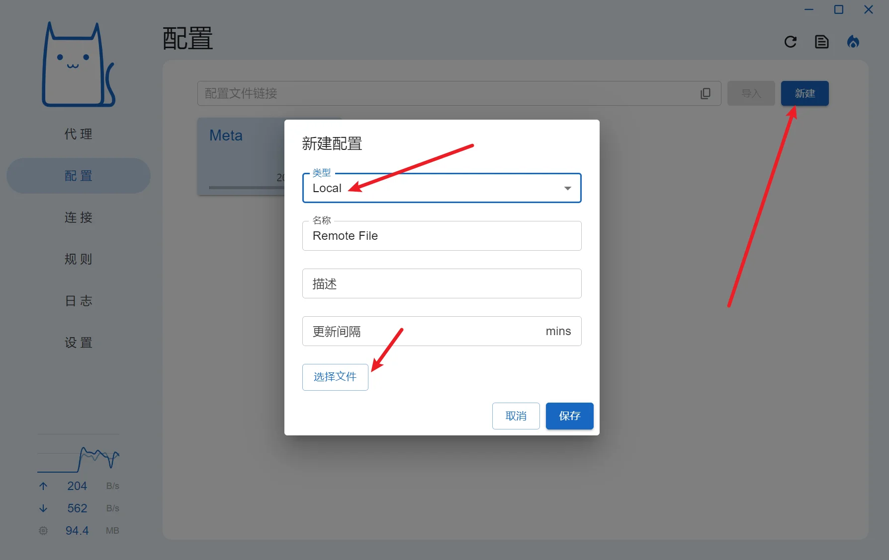
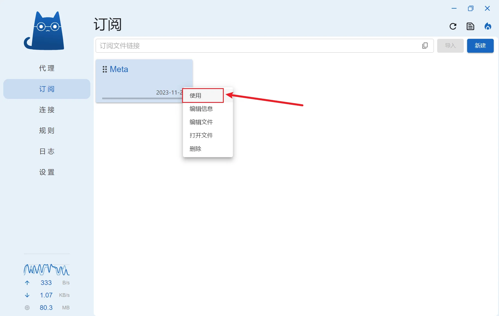

## 本地配置使用方法

<!-- prettier-ignore -->
!!! 提示
    此配置的意义在于：自定义配置，无需使用订阅转换，且不会被机场下发的配置覆盖。

    由于下载规则集文件需要使用代理，建议使用该配置前先导入机场配置。

<!-- prettier-ignore -->
!!! 注意
    部分分支对UI进行修改，存在一定差异，以下内容仅在 Clash Verge Rev 中进行测试

### 1.下载配置文件到本地

`Mihomo.yaml`

<a id="downloadLink" href="https://gitlab.com/Nessk/vpn/-/raw/main/Clash/Meta/Mihomo.yaml">点击下载文件</a>
<script>
  document.addEventListener('DOMContentLoaded', function () {
    const link = document.getElementById('downloadLink');
    link.addEventListener('click', function (event) {
      event.preventDefault();
      const url = this.href;
      const filename = url.substring(url.lastIndexOf('/') + 1);
      fetch(url)
        .then(response => response.blob())
        .then(blob => {
          const downloadUrl = URL.createObjectURL(blob);
          const a = document.createElement('a');
          a.href = downloadUrl;
          a.download = filename;
          document.body.appendChild(a);
          a.click();
          document.body.removeChild(a);
          URL.revokeObjectURL(downloadUrl);
        })
        .catch(console.error);
    });
  });
</script>

```
https://gitlab.com/Nessk/vpn/-/raw/main/Clash/Meta/Mihomo.yaml
```


### 2.修改配置 `proxy-providers` 机场订阅地址

将 `http://your-service-provider` 替换为你的机场订阅地址，如果要添加多个机场，可以参考 [添加机场订阅](../clash/verge-editprofile.md?#_1)


```yaml
p: &p {type: http, interval: 86400, health-check: {enable: true, url: http://connectivitycheck.gstatic.com/generate_204, interval: 1800, timeout: 5000}}
proxy-providers:
  Subscribe: # 在此将 "http://your-service-provider" 替换为你的机场订阅，推荐使用 base64 或者 node list
    url: http://your-service-provider
    <<: *p
    #override: # 修改节点前后缀时，需移除前方的 "#" 符号
      #additional-prefix: "节点前缀"
      #additional-suffix: "节点后缀"
  #Subscribe2: {url: http://your-service-provider, <<: *p}
```

Mihomo(ClashMeta) 内核支持解析 base64 格式的订阅，可按照下图提示复制机场订阅


### 3.Clash Verge 中导入 **配置/订阅**

<!-- prettier-ignore -->
!!! 提示
    WIN 系统第一次启动会要求允许防火墙权限，允许即可；部分客户端第一次启动显示英文，可进入设置修改；

* 打开Clash Verge，点击左侧 **配置/订阅**，点击右上角**新建**
* 类型选择**Local**，点击下方 **选择文件**，选择修改好的文件
* 对导入的配置选中，并点击右键 → **启用/使用**
* 等待右上角提示 **Refresh clash config** 后, 点击左侧 **设置** → 勾选 **系统代理** （右下角托盘里右键图标亦可更改）
* 点击左侧 **代理** ，按需设置对应的分流







