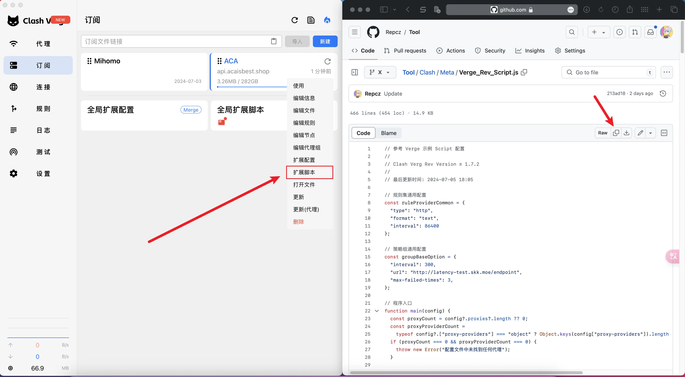
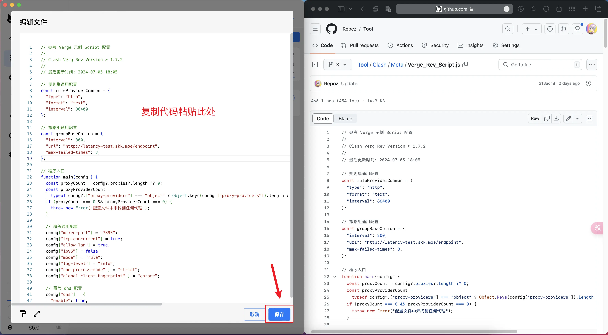

## 脚本配置使用方法

<!-- prettier-ignore -->
!!! 提示
    此配置的意义在于：自定义配置，无需使用订阅转换，且不会被机场下发的配置覆盖。

    由于此配置只能在远程订阅配置的基础上修改，且下载规则集文件需要使用代理，需使用该配置前先导入机场配置。

<!-- prettier-ignore -->
!!! 注意
    以下内容仅在 Clash Verge Rev 中进行测试

### 1.导入机场配置

建议使用一键导入，避免出现不必要的问题

### 2.导入脚本配置

[点击链接](https://gitlab.com/Nessk/vpn/-/raw/main/Clash/Meta/Override.js)，复制文件内容

右键需要修改的机场订阅配置，选择 **拓展脚本**

### 3.更新并启用配置

导入之后需更新配置，并确保启用该配置！