# SubStore 部署

## iOS代理软件部署


<!-- prettier-ignore -->
!!! 注意
    iOS代理软件上部署 SubStore，依赖 MitM & 重写，使用前需**安装信任根证书**，并开启相应的开关

### 安装


- Loon：[点击一键导入](https://www.nsloon.com/openloon/import?plugin=https://raw.githubusercontent.com/sub-store-org/Sub-Store/master/config/Loon.plugin)


- QX：[点击一键导入](https://quantumult.app/x/open-app/add-resource?remote-resource=%7B%0A%20%20%22rewrite_remote%22%20%3A%20%5B%0A%20%20%20%20%22https%3A%2F%2Fmirror.ghproxy.com%2Fhttps%3A%2F%2Fraw.githubusercontent.com%2FPeng-YM%2FSub-Store%2Fmaster%2Fconfig%2FQX.snippet%2C%20tag%3DSub-Store%2C%20update-interval%3D172800%2C%20opt-parser%3Dfalse%2C%20enabled%3Dtrue%22%0A%20%20%5D%0A%7D)

- Surge & Shadowrocket

安装使用模块即可。

```
https://raw.githubusercontent.com/sub-store-org/Sub-Store/master/config/Surge-ability.sgmodule
```

- Stash

启动Stash后，在 **设置** - **配置列表** 中下拉点击 **Sub-Store** 即可。

  
### 访问

浏览器打开 https://sub.store 


## VPS Docker 部署

<!-- prettier-ignore -->
!!! 注意
    以下基于 **Debain 11** 系统

需要一台 VPS

需要一个域名，并设置 DNS解析 至 VPS 的 IP 上

　
### 设置域名解析


此处以 [CloudFlare](https://dash.cloudflare.com/) 添加 `A` 记录 为例

首先需要把 域名，托管到 CloudFlare

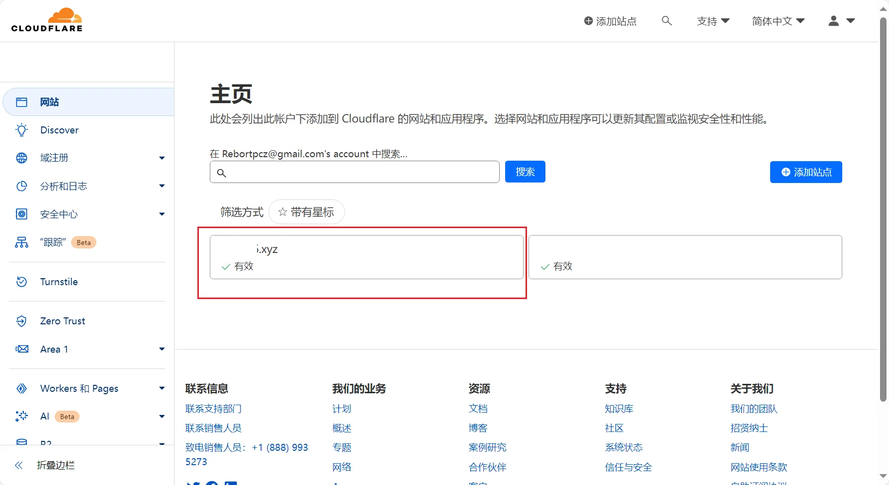


假设2级域名为 `sub`，则设置的域名 `sub.xxxxxx.xyz`，解析到 VPS 对应的 IP 上；

当然，则解析过去需要一定的时间。

### SSH登录

此处 SSH 客户端为 FinalShell


独立 IP 的 VPS 一般默认 22 端口

部分机场会屏蔽 22 端口，需设置端口分流绕开此类机场

### 安装 Docker

以下将使用 [科技lion](https://kejilion.blogspot.com/2023/08/lionldnmp.html) 的脚本

```
curl -sS -O https://raw.githubusercontent.com/kejilion/sh/main/kejilion.sh && chmod +x kejilion.sh && ./kejilion.sh
```

1. 升级并安装 `curl`

```
apt update -y  && apt install -y curl
```

使用 `回车` 发送/执行 命令


2. 执行一键脚本


```
curl -sS -O https://raw.githubusercontent.com/kejilion/sh/main/kejilion.sh && chmod +x kejilion.sh && ./kejilion.sh
```

3. 安装 `docker`

在脚本执行界面，输入 `6`，进入 docker 管理

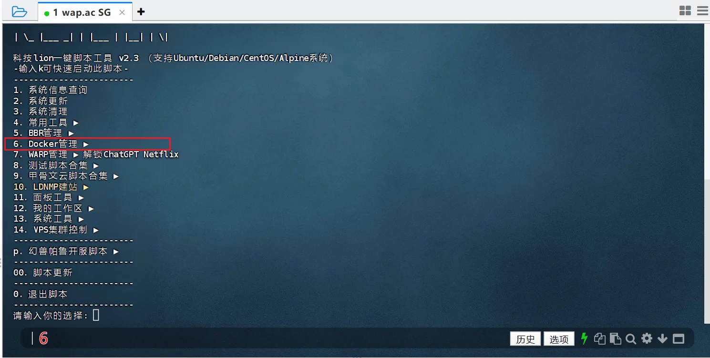

输入 `1`，安装 docker 

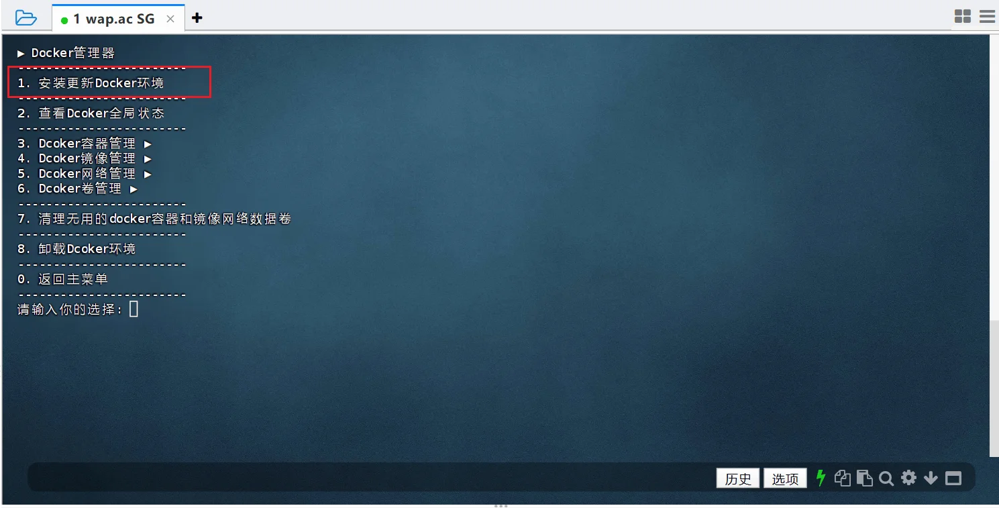


等待安装完成，输入任意字符结束操作

安装完成后，SSH 界面内(不是下面的输入框)，按住 `ctrl` + `c`(这里并不是win系统里面的复制) ，结束当前脚本。

### 部署 `SubStore`

- 全功能带推送

```
docker run -it -d --restart=always -e "SUB_STORE_PUSH_SERVICE=https://api.day.app/XXXXXXXXXXXX/[推送标题]/[推送内容]?group=SubStore&autoCopy=1&isArchive=1&sound=shake&level=timeSensitive&icon=https%3A%2F%2Fraw.githubusercontent.com%2F58xinian%2Ficon%2Fmaster%2FSub-Store1.png"  -e "SUB_STORE_CRON=0 0 * * *" -e SUB_STORE_FRONTEND_BACKEND_PATH=/2cXaAxRGfddmGz2yx1wA -p 127.0.0.1:3001:3001 -v /root/sub-store-data:/opt/app/data --name sub-store xream/sub-store
```

- 不带推送

```
docker run -it -d --restart=always -e "SUB_STORE_CRON=0 0 * * *" -e SUB_STORE_FRONTEND_BACKEND_PATH=/2cXaAxRGfddmGz2yx1wA -p 127.0.0.1:3001:3001 -v /root/sub-store-data:/opt/app/data --name sub-store xream/sub-store
```


<!-- prettier-ignore -->
!!! 注意
    `SUB_STORE_FRONTEND_BACKEND_PATH=/`后的字段(此处是`2cXaAxRGfddmGz2yx1wA`)表示 API，需自行设置并保存好；

如果不知道输入什么，可以用 科技lion 的脚本 ，13系统工具 → 14密码生成

FianlShell中，复制可以在选中后，点击按钮复制


## 反向代理

`NginxProxyManager 反代` 和 `Caddy 反代`, 2选1 即可。

### NginxProxyManager 反代

#### 获取 SubStore Docker容器的 IP

科技lion脚本 ，6Docker管理 → 5网络管理

记住现在获取到 IP ，此处为：`172.17.0.3`

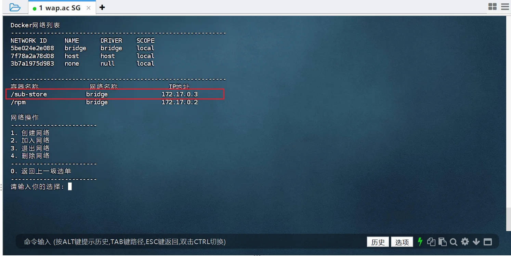


#### 部署 NginxProxyManager 可视化面板

科技lion脚本 ，11面板工具 → 4NginxProxyManager可视化面板

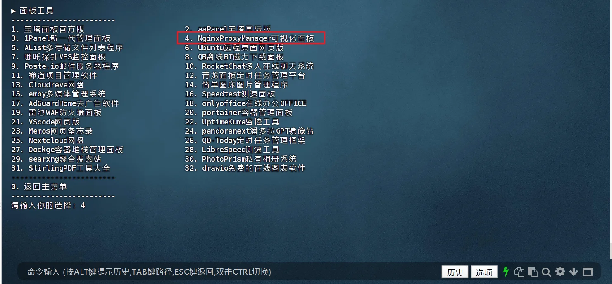

部署完成后，会给默认的账户、密码

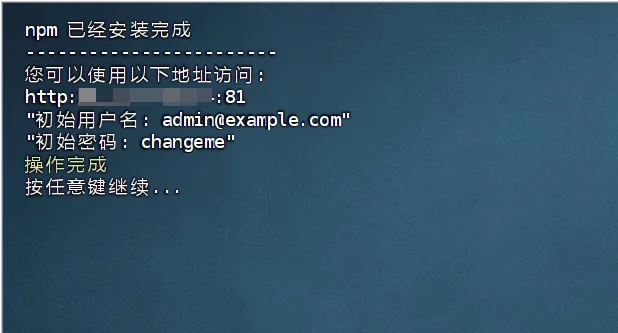


#### NginxProxyManager 登录、修改密码

简单来说，上面的部署 SubStore 的指令，使得只能在 VPS 本地，访问 `127.0.0.1:3001`

反代的作用，就是直接通过访问域名，并且是使用 Https 进行访问，来进入 `本地/VPS的ip+端口` 形式的服务

访问`IP:81`，初次登录，需要在登陆后修改账号、密码

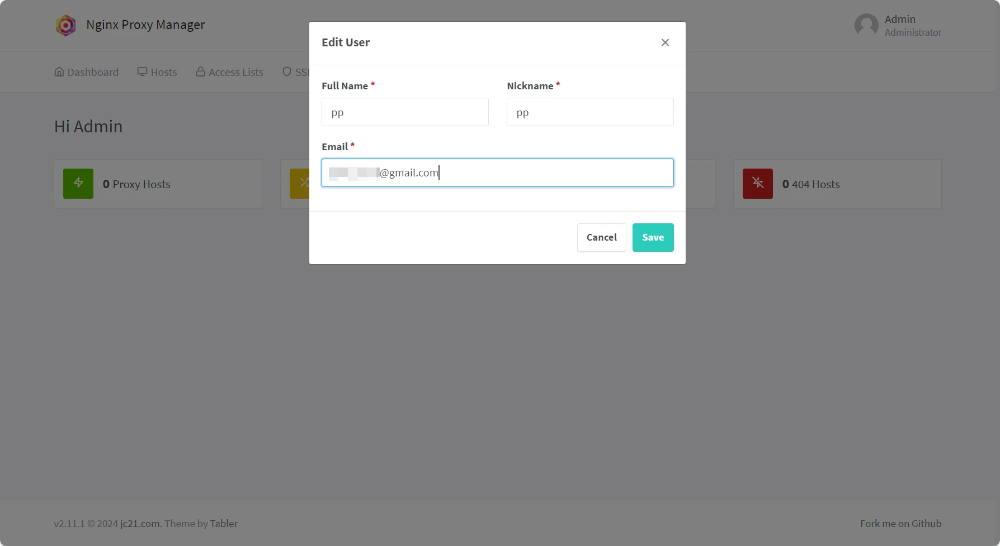

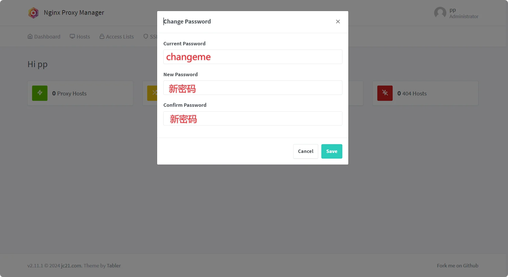


#### NginxProxyManager 设置 SSL 证书

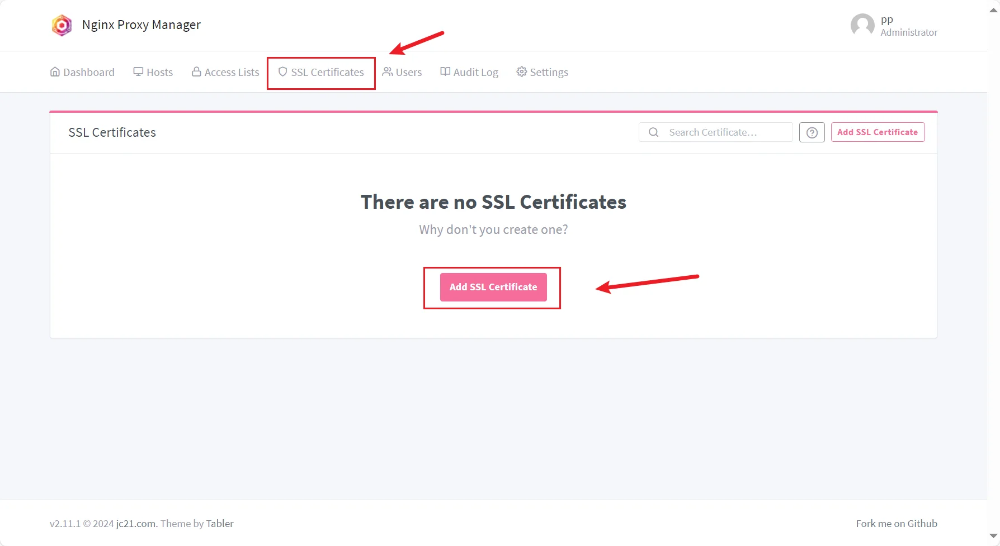

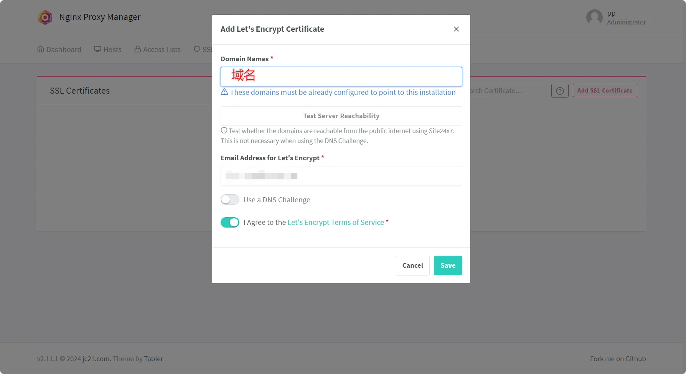


#### NginxProxyManager 添加反代 

输入对应的 IP、端口、域名

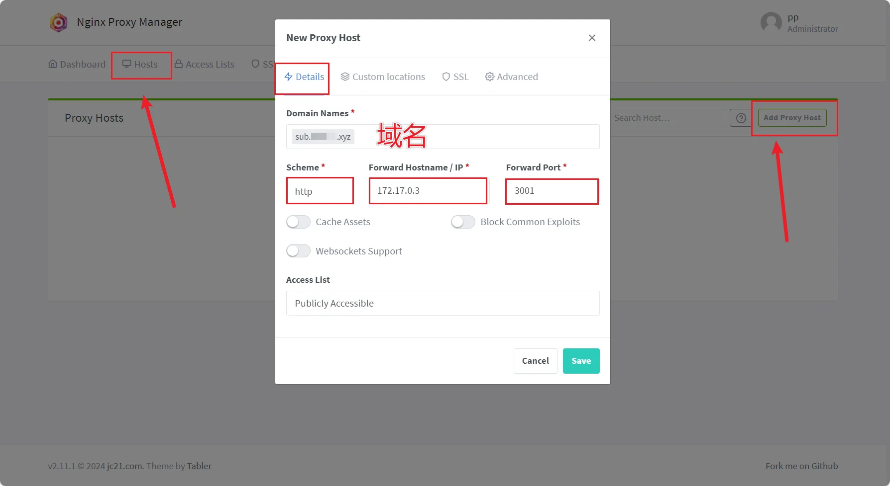

SSL 选中刚才申请的证书，勾选 `Force SSL`

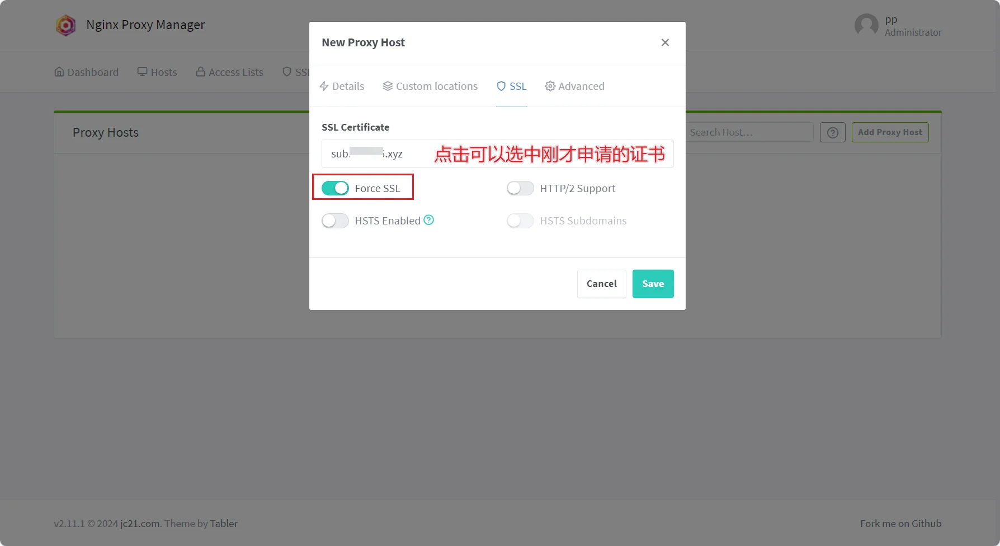

### Caddy 反代

#### 安装 Caddy

参考[官方教程](https://caddy2.dengxiaolong.com/docs/install)，依次执行以下命令

```
sudo apt install -y debian-keyring debian-archive-keyring apt-transport-https
```

```
curl -1sLf 'https://dl.cloudsmith.io/public/caddy/stable/gpg.key' | sudo gpg --dearmor -o /usr/share/keyrings/caddy-stable-archive-keyring.gpg
```

```
curl -1sLf 'https://dl.cloudsmith.io/public/caddy/stable/debian.deb.txt' | sudo tee /etc/apt/sources.list.d/caddy-stable.list
```

```
sudo apt update
```

```
sudo apt install caddy
```

#### Caddy 添加反代

粘贴以下代码，写入反代配置

<!-- prettier-ignore -->
!!! 注意
    `sub.xxxxx.xyz`替换为你的域名

```
cat << EOF > /etc/caddy/Caddyfile
sub.xxxxx.xyz {
    reverse_proxy 127.0.0.1:3001
    }
EOF
```

写入进程守护

```
sudo systemctl enable --now caddy
```

完成后重载配置

```
sudo systemctl reload caddy
```


??? note "Caddy 启动、停止、重启、查看状态"
    启动

    ```
    sudo systemctl start caddy
    ```

    停止

    ```
    sudo systemctl stop caddy
    ```

    重启

    ```
    sudo systemctl reload caddy
    ```

    查看状态
    
    ```
    systemctl status caddy
    ```


## 访问 SubStore

此时，SubStore 地址为：https://sub.xxxxx.xyz 

其 API 为 

```
https://sub.xxxxx.xyz/2cXaAxRGfddmGz2yx1wA 
```

浏览器访问 

```
https://sub.xxxxx.xyz?api=https://sub.xxxxx.xyz/2cXaAxRGfddmGz2yx1wA 
```


