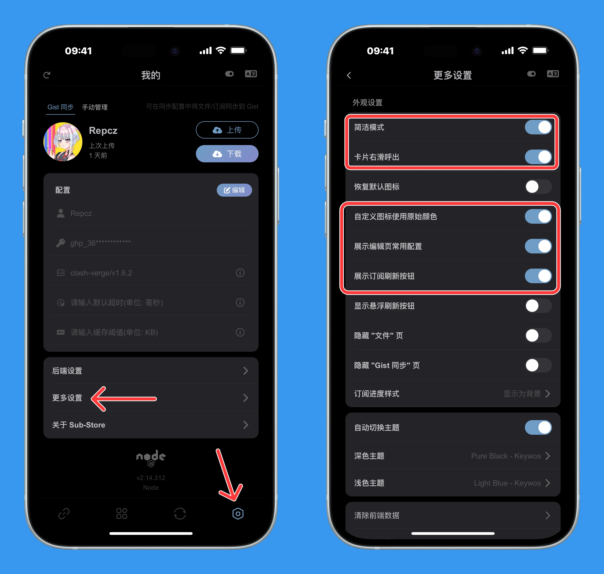
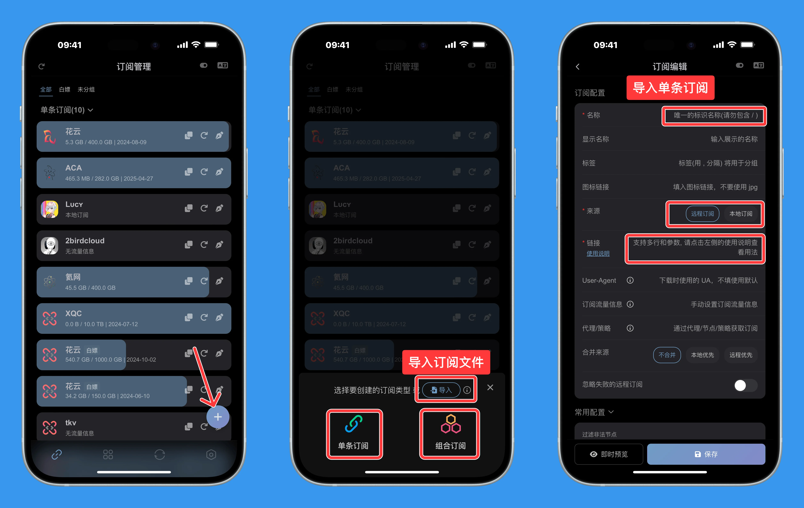
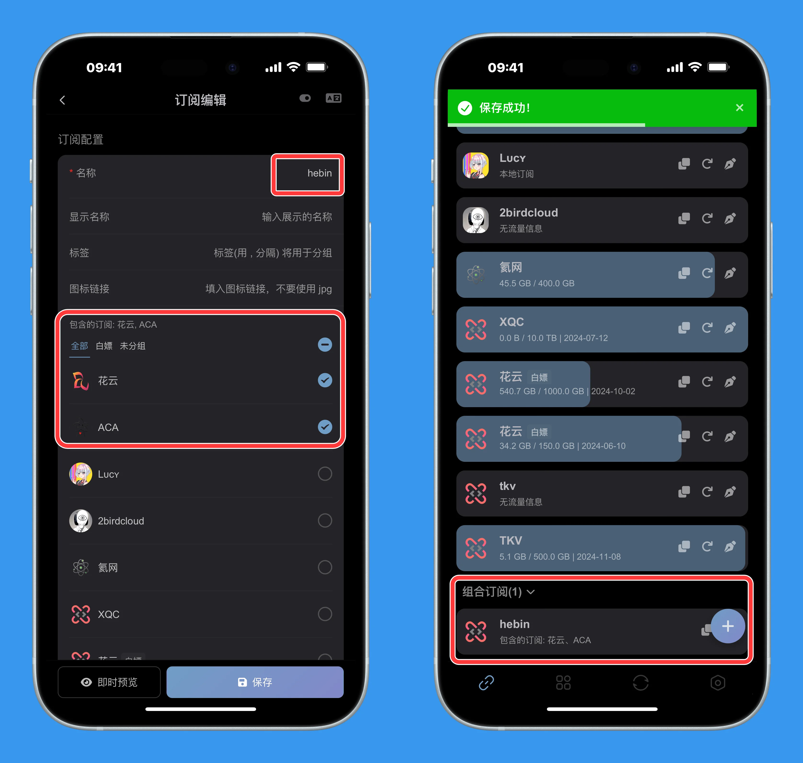
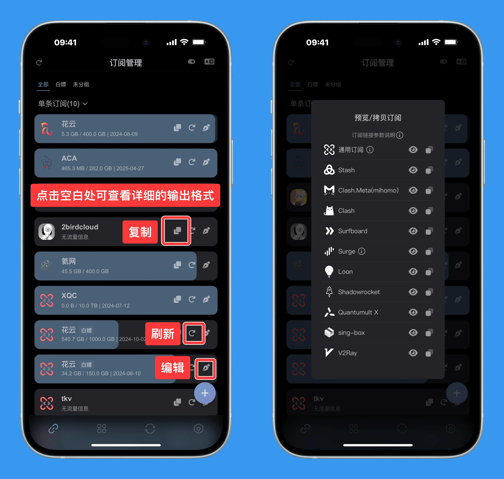
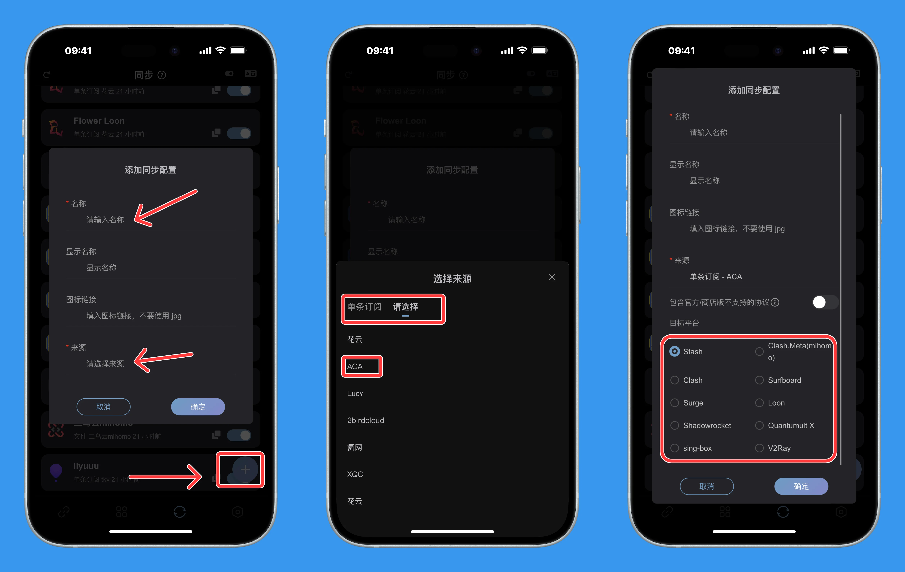
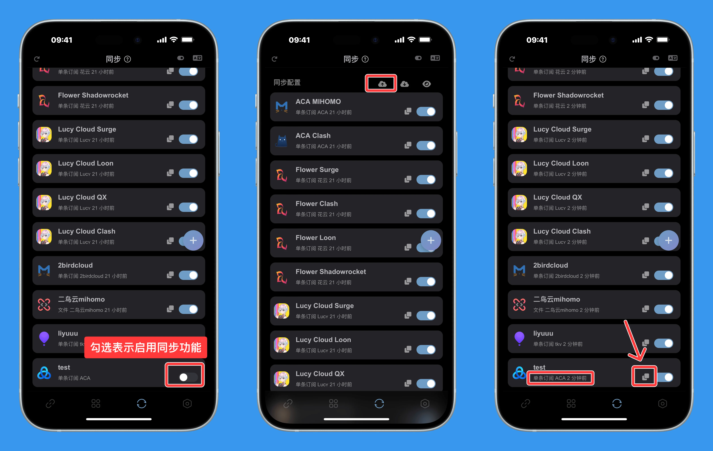

# Sub Store 简易上手

Sub Store 是一款用于管理节点订阅的工具，可通过代理软件/VPS/软路由进行部署。

其基本逻辑是：机场订阅/自建节点导入Sub Store中 → 经过 Sub Store 处理后(重命名/筛选等操作) → 输出对应软件格式的链接 → 导入至对应的软件中使用。

以下仅展示一些基本的操作

## iOS代理软件部署


<!-- prettier-ignore -->
!!! 注意
    iOS代理软件上部署 SubStore，依赖 MitM & 重写，使用前需**安装信任根证书**，并开启相应的开关

### 安装


- Loon：[点击一键导入](https://www.nsloon.com/openloon/import?plugin=https://raw.githubusercontent.com/sub-store-org/Sub-Store/master/config/Loon.plugin)


- QX：[点击一键导入](https://quantumult.app/x/open-app/add-resource?remote-resource=%7B%0A%20%20%22rewrite_remote%22%20%3A%20%5B%0A%20%20%20%20%22https%3A%2F%2Fmirror.ghproxy.com%2Fhttps%3A%2F%2Fraw.githubusercontent.com%2FPeng-YM%2FSub-Store%2Fmaster%2Fconfig%2FQX.snippet%2C%20tag%3DSub-Store%2C%20update-interval%3D172800%2C%20opt-parser%3Dfalse%2C%20enabled%3Dtrue%22%0A%20%20%5D%0A%7D)

- Surge & Shadowrocket

安装使用模块即可。

```
https://raw.githubusercontent.com/sub-store-org/Sub-Store/master/config/Surge-ability.sgmodule
```

- Stash

启动Stash后，在 **设置** - **配置列表** 中下拉点击 **Sub-Store** 即可。

  
### 访问

浏览器打开 https://sub.store 

<!-- prettier-ignore -->
!!! 注意
    以下操作以 前端v2.14.233、后端v2.14.312 为例

    并且修改了默认的显示样式，如下图

    

## 添加订阅

### 添加单条订阅

首页点击右下角添加按钮 → 选择单条订阅 → 输入名称(简易英文)、链接(即你的机场订阅) → 点击右下角保存



- 来源为远程订阅时，可对输入的链接添加参数，具体见链接下的使用说明

- 本地订阅：可换行输入多个单行的代理协议/JSON/URI，也可输入完整的Base64/YAML内容

- 左下角「即时预览」：查看当前操作后的节点信息与原始节点信息

### 添加组合订阅

添加组合订阅前需添加至少两个条单独的订阅




## 输出订阅

当你输入订阅后，点击订阅旁边的复制按钮，即可复制出一条类似 `https://sub.store/download/xxx` 的链接。这表示你正在使用代理软件搭建背本地 Sub Store。



你也可以点击订阅的空白处，查看详细的输出格式和链接。

此时「该链接」仅支持在「搭建 Sub Store 的设备」中使用，且必须「开启代理软件」时，才可以进行更新。

<!-- prettier-ignore -->
!!! 举例
    使用 Loon 搭建的 Sub Store ，并且 Loon 处于开启状态。
    
    此时该链接可以给 Loon 本身使用，也可以给其他代理例如 QX、Surge 使用。
    
    Sub Store 会根据软件请求的 UA ，自动输出对应格式的订阅内容。

    但是当关闭 Loon 时, Loon 和其他代理软件都无法使用该链接。

如果你使用的是VPS部署的Sub Store，复制出的链接应该是 `https://substore.xxxxx.xyz/xxxxxxx/download/xxxx`。此时该链接可以脱离代理软件使用。


## 节点操作

## 同步配置

Sub Store 可通过 Github Gist 同步当前配置，需要填入 Github Username 和 token。

获取 token 可参考[官方文档](https://docs.github.com/zh/authentication/keeping-your-account-and-data-secure/managing-your-personal-access-tokens)或自行谷歌。

当代理软件部署 Sub Store 并使用 Github tokne 登录后，即可上传或下载当前配置。


在多个代理软件中同时部署了 Sub Store 并使用 Github tokne 登录且同步配置后，可在切换代理软件后继续使用同一个订阅链接。

<!-- prettier-ignore -->
!!! 举例
    当 Loon 和 Surge 都部署了 Sub Store 并使用 Github tokne 登录且同步后。
    
    这两个软件都可使用`https://sub.store/download/xxx`

    如果先在 Loon 中对节点进行了操作，需在设置页中上传当前配置；启动 Surge 后，再在设置页中下载配置。即可同步刚才 Loon 中修改后的配置。


## 导出 Gist

<!-- prettier-ignore -->
!!! 注意
    此操作必须使用 Github token 登录后才可进行

导出 Gist 订阅链接的意义：使订阅可以在其他未部署 Sub Store 的设备中使用。更新也不依赖代理软件(需正常访问Github)。

选择你要同步的订阅内容和要输出的格式（也可以选择输出文件）；




勾选以启用同步功能，手动同步至gist，复制链接使用。



