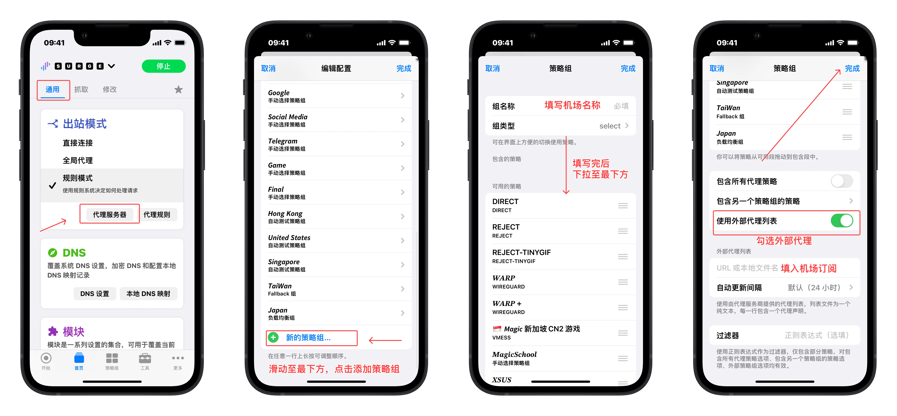
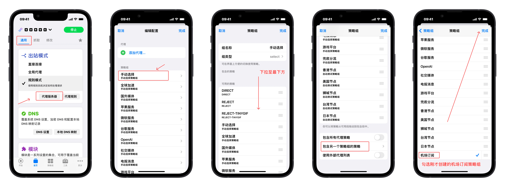
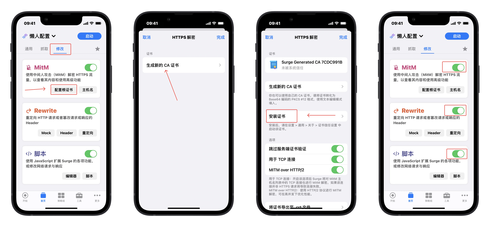
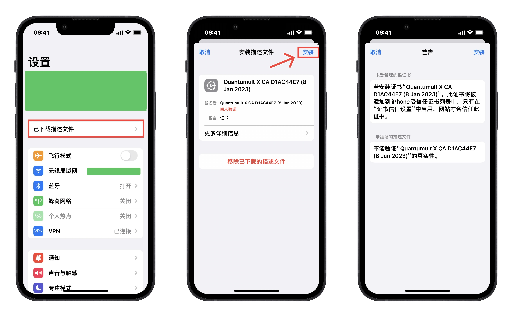
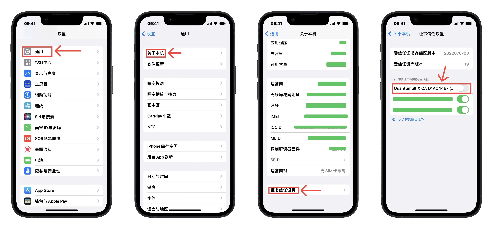
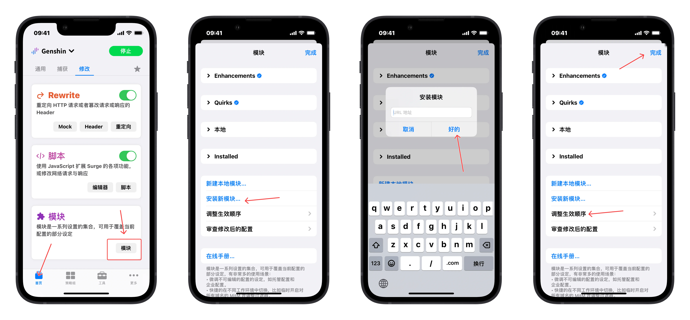

# Surge

## Surge iOS 

<a href="https://apps.apple.com/app/id1442620678"></a>  


## 导入配置

<!-- prettier-ignore -->
!!! 兼容性声明
    需要 Surge Version ≥ 5.11.0

    需要解锁 Smart 策略组

### 添加 **配置文件** 

> 配置参数解释见：_[GetSomeCats/Surge](https://raw.githubusercontent.com/getsomecat/GetSomeCats/Surge/SurgePro.conf)_

```
https://gitlab.com/Nessk/vpn/-/raw/main/Surge/Surge.conf
```

* 运行 **Surge** ，在 **首页** ， 点击 **顶部区域**
* 弹出的 **设置** 菜单中，在下方 **导入** 区域，点击 **从URL下载配置**
* 将配置文件链接填入并保存


### 添加机场订阅

> 机场订阅本地转换可参考[Sub-Store 教程](https://getupnote.com/share/notes/8SiMnOcwXxZ3xEtK4k2v9Gr3pv32/7522F394-6D73-414E-BE04-1455EDB15B9F)

*  在 **首页**  —— **通用** 中， 点击 **代理服务器** 
* 弹出的菜单中，在 **策略组** 最下方 ，点击 **新的策略组**
* **组名称** 填写为 机场名称，并下拉至最下方
* 勾选 **使用外部代理列表** ，并填写 **机场订阅**

 

### 将 机场订阅策略组 导入 手动选择策略组

*  在 **首页**  —— **通用** ， 点击 **代理服务器** 
* 弹出的菜单中，在 **策略组** 最上方 ，点击 **手动选择**，并在弹出的菜单中，下拉至最下方
* 点击 **包含另一个策略组的策略** ，在弹出的页面中，勾选刚才生成的 包含机场订阅的策略组

<!-- prettier-ignore -->
!!! 提示
    此时，`手动选择`策略组 即为显示所有节点的策略组；如果要添加多个机场，重复 2、3 步骤即可


 

## 证书设置

### 生成证书

* 在 **首页**  —— **修改** ，点击 **MitM** 区域的 **配置根证书** 
* 弹出的菜单中，点击 **生成新的CA证书**
* 在弹出的菜单中，点击 **安装证书**

 

* **确定** 提示后，在Safari中 **允许** 下载配置文件
* 并勾选 **MitM** 、**Rewrite** 、**脚本** 的开关

### 安装描述文件

此处借用QX的图

* 在 **系统设置** 中，点击 **已下载描述文件** ，并 **安装**



### 信任描述文件

* 在 **系统设置** - **通用** - **关于本机** - **证书信任设置** 中，勾选已安装的描述文件



## 导入模块

* **首页** —— **通用** —— **模块** 中，点击 **模块** 按钮
* 弹出的页面中，下滑至 **安装的模块** 最下方，点击 **安装新模块**
* 将模块链接(raw链接)填入并保存，等待下载外部资源
* 下载完成后，点击最下方的 **调整生效顺序**，按需调整模块生效顺序（按需）

 

<!-- prettier-ignore -->
!!! 提示
    注意：新安装模块不会自动启用，需自行勾选


## Surge macOS

https://dl.nssurge.com/mac/v5/Surge-latest.zip


## 导入配置

<!-- prettier-ignore -->
!!! 兼容性声明
    需要 Surge Version ≥ 5.11.0

    需要解锁 Smart 策略组

### 添加 **配置文件** 

> 配置参数解释见：_[GetSomeCats/Surge](https://raw.githubusercontent.com/getsomecat/GetSomeCats/Surge/SurgePro.conf)_

```
https://gitlab.com/Nessk/vpn/-/raw/main/Surge/Surge.conf
```

* 运行 **Surge** ，点击侧边栏最下方的 **更多** 按钮
* 弹出的页面中，点击 **配置** 区域，点击 **从URL下载配置**
* 将配置文件链接填入并保存


### 添加机场订阅

* 双击新导入的配置，确保配置处于启用状态
* 点击侧边栏的 **策略** 按钮，右键 **手动选择** 策略组
* 将机场订阅填入并保存


