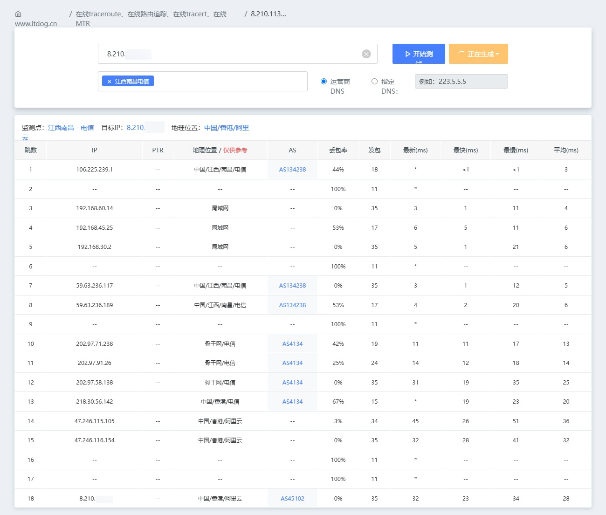
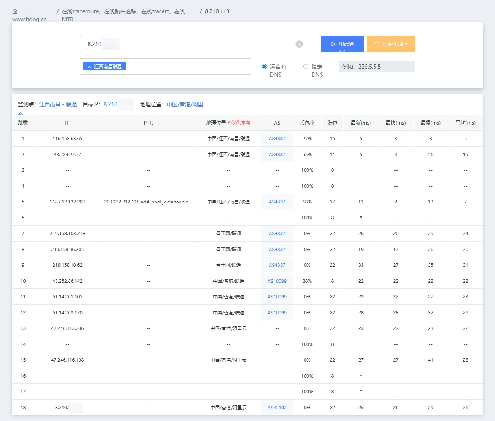
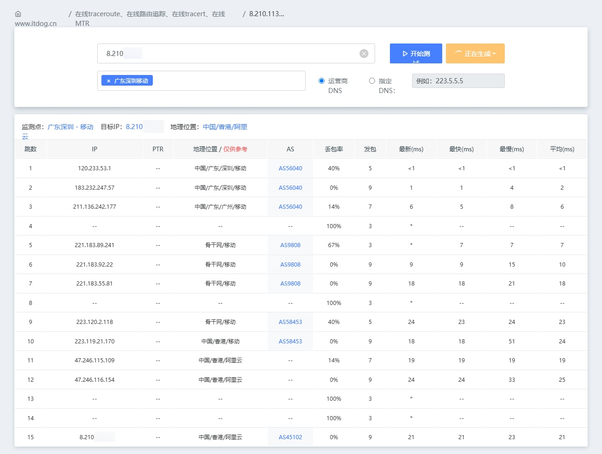

### 官网

https://www.aliyun.com/

### 去程路由

- 江西南昌电信 IPv4



- 江西联通电信 IPv4



- 广东广州移动 IPv4 ([ITDOG](https://www.itdog.cn/traceroute/)没有江西移动)




### IP质量检测

```
########################################################################
                       IP质量体检报告：8.210.*.*
                    bash <(curl -sL IP.Check.Place)
                   https://github.com/xykt/IPQuality
        报告时间：2024-05-25 19:48:23 CST  脚本版本：v2024-05-17
########################################################################
一、基础信息（Maxmind 数据库）
自治系统号：            AS45102
组织：                  Alibaba US Technology Co., Ltd.
坐标：                  114°10′33″E, 22°17′3″N
地图：                  https://check.place/22.2842,114.1759,15,cn
城市：                  N/A, 香港
使用地：                [HK]香港, [AS]亚洲
注册地：                [SG]新加坡
时区：                  Asia/Hong_Kong
IP类型：                 广播IP 
二、IP类型属性
数据库：      IPinfo    ipregistry    ipapi     AbuseIPDB  IP2LOCATION 
使用类型：     机房        机房        商业        机房        机房    
公司类型：     机房        机房        商业    
三、风险评分
风险等级：      极低         低       中等       高         极高
SCAMALYTICS：  1|低风险
ipapi：       0.21%|低风险
AbuseIPDB：    0|低风险
IPQS：                        75|可疑IP
DB-IP：         |低风险
四、风险因子
库： IP2LOCATION ipapi ipregistry IPQS SCAMALYTICS ipdata IPinfo IPWHOIS
地区：    [HK]    [HK]    [HK]    [HK]    [HK]    [HK]    [HK]    [HK]
代理：     否      否      否      是      否      否      否      否 
Tor：      否      否      否      否      否      否      否      否 
VPN：      否      是      否      是      否      无      否      否 
服务器：   是      是      是      无      是      否      是      是 
滥用：     否      否      否      否      无      否      无      无 
机器人：   否      否      无      否      否      无      无      无 
五、流媒体及AI服务解锁检测
服务商：  TikTok   Disney+  Netflix Youtube  AmazonPV  Spotify  ChatGPT 
状态：     失败     屏蔽    仅自制    解锁     解锁     屏蔽     仅APP  
地区：                       [HK]     [HK]     [HK]              [HK]   
方式：                       原生     原生     原生              原生   
六、邮局连通性及黑名单检测
本地25端口：阻断
IP地址黑名单数据库：  有效 439   正常 435   已标记 3   黑名单 1
========================================================================
脚本今日运行次数：283；总运行次数：12227。感谢使用xy系列脚本！ 

```


### 融合怪测试

```
--------------------- A Bench Script By spiritlhl ----------------------
                   测评频道: https://t.me/vps_reviews                    
版本：2024.05.24
更新日志：VPS融合怪测试(集百家之长)                       
---------------------基础信息查询--感谢所有开源项目---------------------
 CPU 型号          : Intel(R) Xeon(R) Platinum
 CPU 核心数        : 2
 CPU 频率          : 2500.002 MHz
 CPU 缓存          : L1: 64.00 KB / L2: 1.00 MB / L3: 33.00 MB
 AES-NI指令集      : ✔ Enabled
 VM-x/AMD-V支持    : ❌ Disabled
 内存              : 318.02 MiB / 925.34 MiB
 Swap              : [ no swap partition or swap file detected ]
 硬盘空间          : 3.88 GiB / 39.07 GiB
 启动盘路径        : /dev/vda1
 系统在线时间      : 9 days, 2 hour 26 min
 负载              : 0.59, 0.17, 0.05
 系统              : Debian GNU/Linux 11 (bullseye) (x86_64)
 架构              : x86_64 (64 Bit)
 内核              : 6.8.6
 TCP加速方式       : bbr
 虚拟化架构        : KVM
 NAT类型           : Full Cone
 IPV4 ASN          : AS45102 Alibaba (US) Technology Co., Ltd.
 IPV4 位置         : Hong Kong / Hong Kong / HK
----------------------CPU测试--通过sysbench测试-------------------------
 -> CPU 测试中 (Fast Mode, 1-Pass @ 5sec)
 1 线程测试(单核)得分:          1086 Scores
 2 线程测试(多核)得分:          1810 Scores
---------------------内存测试--感谢lemonbench开源-----------------------
 -> 内存测试 Test (Fast Mode, 1-Pass @ 5sec)
 单线程读测试:          5438.97 MB/s
 单线程写测试:          9971.11 MB/s
------------------磁盘dd读写测试--感谢lemonbench开源--------------------
 -> 磁盘IO测试中 (4K Block/1M Block, Direct Mode)
 测试操作               写速度                                  读速度
 100MB-4K Block         10.3 MB/s (2515 IOPS, 10.18s)           8.9 MB/s (2161 IOPS, 11.84s)
 1GB-1M Block           131 MB/s (125 IOPS, 8.02s)              123 MB/s (116 IOPS, 8.55s)
---------------------磁盘fio读写测试--感谢yabs开源----------------------
Block Size | 4k            (IOPS) | 64k           (IOPS)
  ------   | ---            ----  | ----           ---- 
Read       | 4.69 MB/s     (1.1k) | 57.88 MB/s     (904)
Write      | 4.72 MB/s     (1.1k) | 58.45 MB/s     (913)
Total      | 9.42 MB/s     (2.3k) | 116.33 MB/s   (1.8k)
           |                      |                     
Block Size | 512k          (IOPS) | 1m            (IOPS)
  ------   | ---            ----  | ----           ---- 
Read       | 55.93 MB/s     (109) | 55.69 MB/s      (54)
Write      | 58.85 MB/s     (114) | 59.22 MB/s      (57)
Total      | 114.78 MB/s    (223) | 114.91 MB/s    (111)
------------流媒体解锁--基于oneclickvirt/CommonMediaTests开源-----------
以下测试的解锁地区是准确的，但是不是完整解锁的判断可能有误，这方面仅作参考使用
----------------Netflix-----------------
[IPV4]
您的出口IP可以使用Netflix，但仅可看Netflix自制剧
NF所识别的IP地域信息：中国香港
[IPV6]
您的网络可能没有正常配置IPv6，或者没有IPv6网络接入
----------------Youtube-----------------
[IPV4]
连接方式: Youtube Video Server
视频缓存节点地域: 中国香港(HKG07S42)
Youtube识别地域: 中国香港(HK)
[IPV6]
Youtube在您的出口IP所在的国家不提供服务
---------------DisneyPlus---------------
[IPV4]
当前出口所在地区解锁DisneyPlus
区域：HK 区
[IPV6]
DisneyPlus在您的出口IP所在的国家不提供服务
解锁Netflix，Youtube，DisneyPlus上面和下面进行比较，不同之处自行判断
----------------流媒体解锁--感谢RegionRestrictionCheck开源--------------
 以下为IPV4网络测试，若无IPV4网络则无输出
============[ Multination ]============
 Dazn:                                  Yes (Region: HK)
 Disney+:                               No
 Netflix:                               Originals Only
 YouTube Premium:                       Yes (Region: HK)
 Amazon Prime Video:                    Yes (Region: HK)
 TVBAnywhere+:                          No
 iQyi Oversea Region:                   HK
 YouTube CDN:                           Hong Kong 
 Netflix Preferred CDN:                 Hong Kong  
 Spotify Registration:                  No
 Steam Currency:                        HKD
 ChatGPT:                               Only Available with Mobile APP
 Bing Region:                           HK
 Wikipedia Editability:                 No
 Instagram Licensed Audio:              Yes
 ---Forum---
 Reddit:                                No
=======================================
 以下为IPV6网络测试，若无IPV6网络则无输出
---------------TikTok解锁--感谢lmc999的源脚本及fscarmen PR--------------
 Tiktok Region:         Failed
-------------IP质量检测--基于oneclickvirt/securityCheck使用-------------
数据仅作参考，不代表100%准确，如果和实际情况不一致请手动查询多个数据库比对
以下为各数据库编号，输出结果后将自带数据库来源对应的编号
ipinfo数据库  [0] | scamalytics数据库 [1] | virustotal数据库  [2] | abuseipdb数据库   [3] | ip2location数据库    [4]
ip-api数据库  [5] | ipwhois数据库     [6] | ipregistry数据库  [7] | ipdata数据库      [8] | db-ip数据库          [9]
ipapiis数据库 [A] | ipapicom数据库    [B] | abstractapi数据库 [C] | cheervision数据库 [D] | ipqualityscore数据库 [E]
IPV4:
安全得分:
声誉(越高越好): 0 [2] 
信任得分(越高越好): 0 [8] 
VPN得分(越低越好): 100 [8] 
代理得分(越低越好): 100 [8] 
社区投票-无害: 0 [2] 
社区投票-恶意: 0 [2] 
威胁得分(越低越好): 100 [8]
欺诈得分(越低越好): 65 [E] 1 [1]
滥用得分(越低越好): 0 [3] 
ASN滥用得分(越低越好): 0.0005 (Very Low) [A] 
公司滥用得分(越低越好): 0.0021 (Low) [A] 
威胁级别: low [9 B] 
黑名单记录统计:(有多少黑名单网站有记录):
无害记录数: 0 [2]  恶意记录数: 0 [2]  可疑记录数: 0 [2]  无记录数: 93 [2]  
安全信息:
使用类型: business [8 A] DataCenter/WebHosting/Transit [3] hosting [0 7 9]
公司类型: hosting [0 7 A] 
是否云提供商: Yes [7 D] 
是否数据中心: No [8] Yes [0 1 5 6 A]
是否移动设备: Yes [E] No [5 A]
是否代理: Yes [E] No [0 1 4 5 6 7 8 9 A B D]
是否VPN: No [0 1 6 7 C D] Yes [A E]
是否Tor: No [0 1 3 6 7 8 A B D E] 
是否Tor出口: No [1 7 D] 
是否网络爬虫: No [9 A B E] 
是否匿名: No [1 6 7 8 D] 
是否攻击者: No [7 8 D] 
是否滥用者: No [7 8 A D E] 
是否威胁: No [7 8 D] 
是否中继: No [0 7 8 D] 
是否Bogon: No [7 8 A D] 
是否机器人: No [E] 
DNS-黑名单: 338(Total_Check) 0(Clean) 6(Blacklisted) 7(Other) 
Google搜索可行性：YES
端口25检测:
  本地: No
  163邮箱：No
----------------三网回程--基于oneclickvirt/backtrace开源----------------
国家: HK 城市: Hong Kong 服务商: AS45102 Alibaba (US) Technology Co., Ltd.
北京电信 219.141.140.10  联通4837   [普通线路] 
北京联通 202.106.195.68  联通4837   [普通线路] 
北京移动 221.179.155.161 移动CMI    [普通线路] 
上海电信 202.96.209.133  联通4837   [普通线路] 
上海联通 210.22.97.1     联通4837   [普通线路] 
上海移动 211.136.112.200 移动CMI    [普通线路] 
广州电信 58.60.188.222   联通4837   [普通线路] 
广州联通 210.21.196.6    联通4837   [普通线路] 
广州移动 120.196.165.24  移动CMI    [普通线路] 
成都电信 61.139.2.69     联通4837   [普通线路] 
成都联通 119.6.6.6       联通4837   [普通线路] 
成都移动 211.137.96.205  移动CMI    [普通线路] 
准确线路自行查看详细路由，本测试结果仅作参考
同一目标地址多个线路时，可能检测已越过汇聚层，除了第一个线路外，后续信息可能无效
---------------------回程路由--感谢fscarmen开源及PR---------------------
依次测试电信/联通/移动经过的地区及线路，核心程序来自ipip.net或nexttrace，请知悉!
广州电信 58.60.188.222
1.45 ms  *  局域网
1.57 ms  *  中国, 香港, aliyun.com, 阿里云
1.95 ms  AS749  美国, defense.gov
2.04 ms  *  中国, 香港, aliyun.com, 阿里云
2.89 ms  *  中国, 香港, chinaunicom.com, 联通
6.11 ms  AS10099  中国, 香港, chinaunicom.com, 联通
11.91 ms  AS4837  中国, 广东, 广州, chinaunicom.com, 联通
13.48 ms  AS4837  中国, 广东, 广州, chinaunicom.com, 联通
7.88 ms  AS4134  中国, 广东, 广州, chinatelecom.com.cn, 电信
11.08 ms  AS4134  中国, 广东, 深圳, chinatelecom.com.cn, 电信
10.17 ms  AS4134  中国, 广东, 深圳, chinatelecom.com.cn, 电信
广州联通 210.21.196.6
1.69 ms  *  局域网
1.48 ms  AS45102  中国, 香港, aliyun.com, 阿里云
2.13 ms  *  中国, 香港, aliyun.com, 阿里云
2.90 ms  *  中国, 香港, chinaunicom.com, 联通
4.37 ms  *  中国, 香港, chinaunicom.com, 联通
3.13 ms  AS10099  中国, 香港, chinaunicom.com, 联通
7.75 ms  AS4837  中国, 广东, 广州, chinaunicom.com, 联通
8.54 ms  AS4837  中国, 广东, 广州, chinaunicom.com, 联通
12.36 ms  AS17816  中国, 广东, 深圳, chinaunicom.com, 联通
16.33 ms  AS17623  中国, 广东, 深圳, chinaunicom.com, 联通
10.38 ms  AS17623  中国, 广东, 深圳, chinaunicom.com, 联通
广州移动 120.196.165.24
1.53 ms  *  局域网
1.41 ms  AS749  美国, defense.gov
2.42 ms  AS58453  中国, 香港, chinamobile.com, 移动
8.36 ms  AS58453  中国, 广东, 广州, chinamobile.com, 移动
9.95 ms  AS9808  中国, 广东, 广州, chinamobile.com, 移动
9.76 ms  AS9808  中国, 广东, 广州, chinamobile.com, 移动
12.19 ms  AS9808  中国, 广东, 广州, chinamobile.com, 移动
15.11 ms  AS9808  中国, 广东, 广州, chinamobile.com, 移动
12.92 ms  AS56040  中国, 广东, 深圳, chinamobile.com, 移动
--------------------自动更新测速节点列表--本脚本原创--------------------
位置             上传速度        下载速度        延迟     丢包率
Speedtest.net    32.26 Mbps      29.70 Mbps      1.77     NULL
中国香港         30.47 Mbps      29.40 Mbps      2.58     0.0%
新加坡           32.91 Mbps      30.55 Mbps      34.98    0.0%
联通WuXi         33.12 Mbps      30.52 Mbps      35.67    0.0%
联通海南         33.22 Mbps      33.84 Mbps      25.70    NULL
电信合肥5G       35.83 Mbps      30.56 Mbps      31.86    0.0%
电信浙江         33.08 Mbps      31.07 Mbps      33.50    NULL
移动杭州5G       33.08 Mbps      30.52 Mbps      33.64    0.0%
------------------------------------------------------------------------
 总共花费      : 10 分 25 秒
 时间          : Sat May 25 19:46:38 CST 2024
------------------------------------------------------------------------
  短链:
    https://paste.spiritlhl.net/u/5PmT2t.txt
```