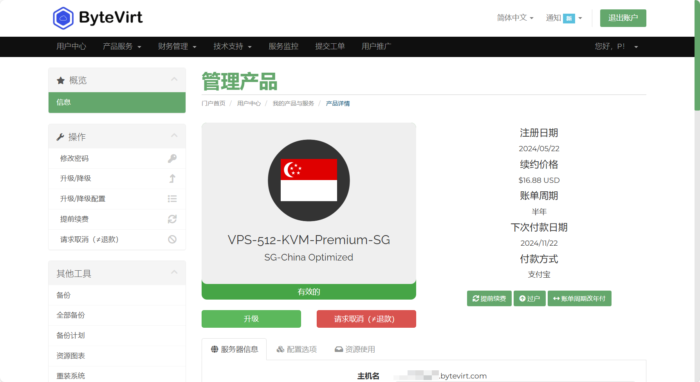
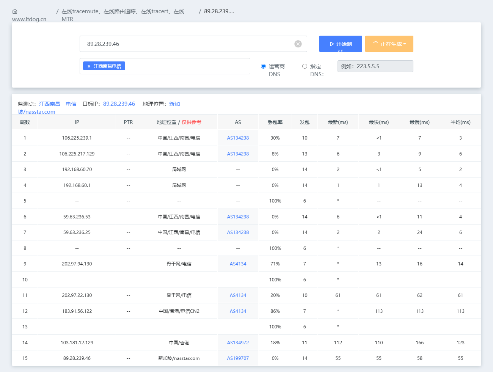
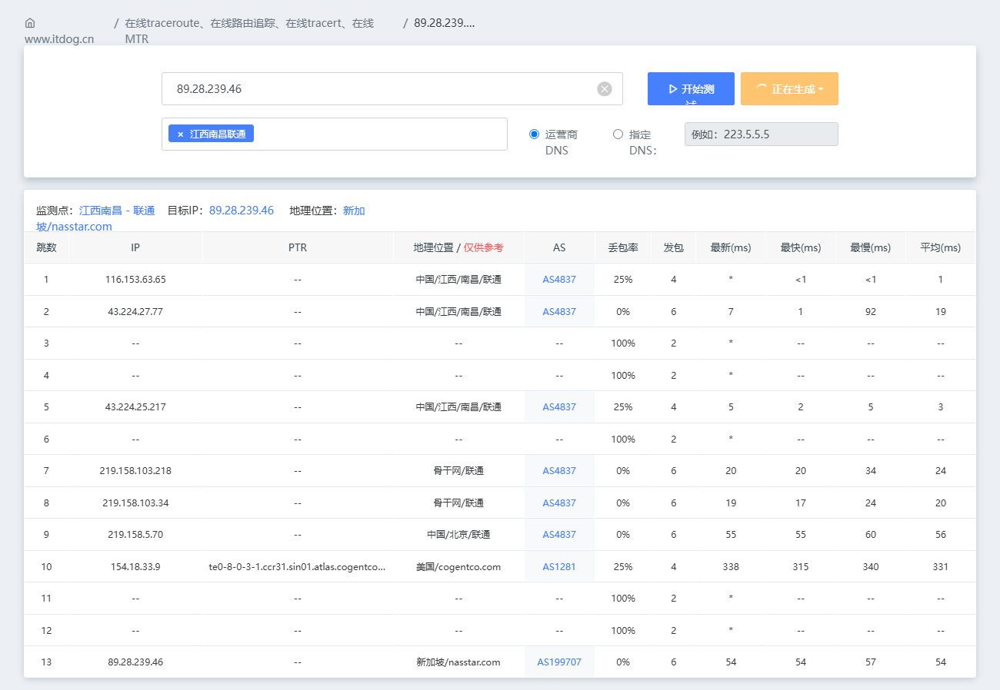
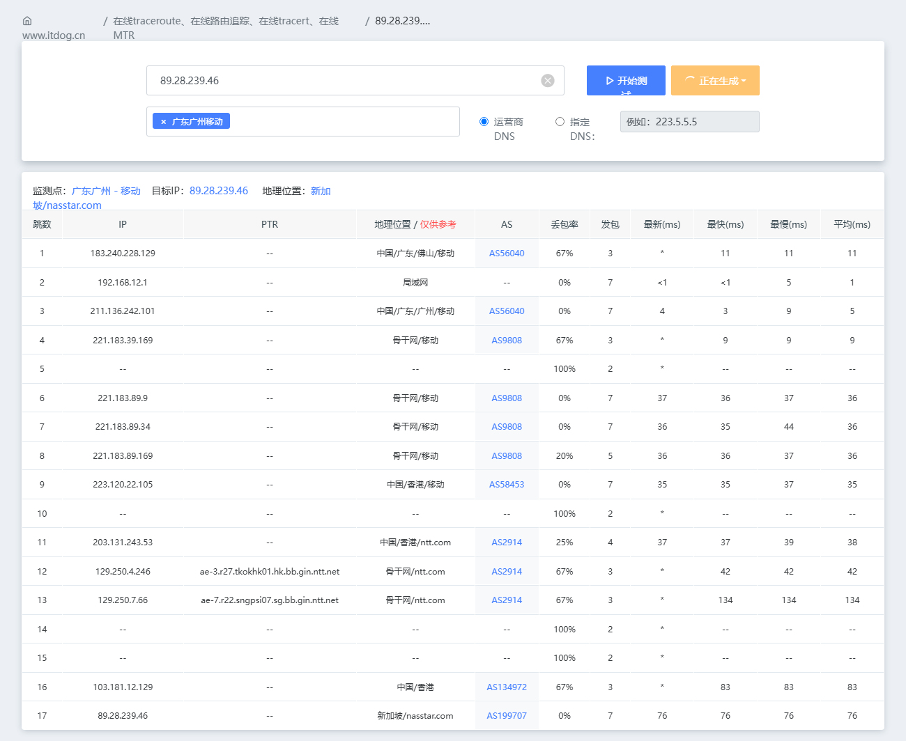

### 官网

https://bytevirt.com


### 套餐详情

[SG-China Optimized](https://bytevirt.com/store/sg-china-optimized)

此次购买的为 `VPS-512-KVM-Premium-SG 半年付`，售价 `16.88 USD`

```
1 AMD EPYC Core(s) (Fair Share)
512MB RAM
15GB NVME
1 IPv4 Addresses
1 IPv6 /64 Addresses
500GB @500Mbps
KVM Virtualization
Singapore, SG Location
3 Snapshots
1 Backup
Premium Network
Looking glass http://89.28.239.46:7788/
```



### 去程路由

- 江西南昌电信 IPv4



- 江西联通电信 IPv4



- 广东广州移动 IPv4 ([ITDOG](https://www.itdog.cn/traceroute/)没有江西移动)




### 回程测试

```
----------------------------------------------------------------------
北京电信
traceroute to 219.141.147.210 (219.141.147.210), 30 hops max, 32 byte packets
 1  89.28.239.1  1.75 ms  AS199707  新加坡, nasstar.com
 2  103.181.12.128  0.49 ms  *  中国, 香港, nearoute.io
 3  *
 4  *
 5  *
 6  *
 7  *
 8  *
 9  219.158.4.29  40.04 ms  AS4837  中国, 广东, 广州, chinaunicom.com, 联通
10  219.158.3.33  38.46 ms  AS4837  中国, 广东, 广州, chinaunicom.com, 联通
11  *
12  *
13  *
14  *
15  *
16  *
17  2.254.120.106.static.bjtelecom.net (106.120.254.2)  146.15 ms  AS4847  中国, 北京, chinatelecom.com.cn, 电信
18  bj141-147-210.bjtelecom.net (219.141.147.210)  76.00 ms  AS4847  中国, 北京, chinatelecom.com.cn, 电信

----------------------------------------------------------------------
上海电信
traceroute to 202.96.209.133 (202.96.209.133), 30 hops max, 32 byte packets
 1  89.28.239.1  9.49 ms  AS199707  新加坡, nasstar.com
 2  103.181.12.128  0.45 ms  *  中国, 香港, nearoute.io
 3  *
 4  *
 5  *
 6  *
 7  *
 8  *
 9  219.158.4.125  43.11 ms  AS4837  中国, 广东, 广州, chinaunicom.com, 联通
10  *
11  *
12  *
13  *
14  *
15  *
16  124.74.229.238  67.16 ms  AS4812  中国, 上海, chinatelecom.com.cn, 电信
17  ns-pd.online.sh.cn (202.96.209.133)  64.51 ms  AS4812  中国, 上海, chinatelecom.com.cn, 电信

----------------------------------------------------------------------
深圳电信
traceroute to 58.60.188.222 (58.60.188.222), 30 hops max, 32 byte packets
 1  89.28.239.1  8.93 ms  AS199707  新加坡, nasstar.com
 2  103.181.12.128  2.09 ms  *  中国, 香港, nearoute.io
 3  *
 4  *
 5  *
 6  *
 7  *
 8  *
 9  219.158.4.101  40.95 ms  AS4837  中国, 广东, 广州, chinaunicom.com, 联通
10  *
11  *
12  *
13  *
14  *
15  *
16  58.60.188.222  45.02 ms  AS4134  中国, 广东, 深圳, chinatelecom.com.cn, 电信

----------------------------------------------------------------------
北京联通
traceroute to 202.106.50.1 (202.106.50.1), 30 hops max, 32 byte packets
 1  89.28.239.1  1.72 ms  AS199707  新加坡, nasstar.com
 2  103.181.12.128  0.43 ms  *  中国, 香港, nearoute.io
 3  *
 4  *
 5  *
 6  ae-2.a02.osakjp02.jp.bb.gin.ntt.net (129.250.4.240)  75.94 ms  AS2914  日本, 大阪府, 大阪, ntt.com
 7  219.158.33.49  98.71 ms  AS4837  中国, 北京, chinaunicom.com, 联通
 8  219.158.16.65  95.10 ms  AS4837  中国, 北京, chinaunicom.com, 联通
 9  *
10  124.64.212.66  98.40 ms  AS4808  中国, 北京, chinaunicom.com, 联通
11  202.106.50.1  93.74 ms  AS4808  中国, 北京, chinaunicom.com, 联通

----------------------------------------------------------------------
上海联通
traceroute to 210.22.97.1 (210.22.97.1), 30 hops max, 32 byte packets
 1  89.28.239.1  1.61 ms  AS199707  新加坡, nasstar.com
 2  103.181.12.128  0.37 ms  *  中国, 香港, nearoute.io
 3  *
 4  *
 5  *
 6  ae-4.r26.osakjp02.jp.bb.gin.ntt.net (129.250.2.42)  82.21 ms  AS2914  日本, 大阪府, 大阪, ntt.com
 7  ae-0.r27.osakjp02.jp.bb.gin.ntt.net (129.250.3.45)  82.62 ms  AS2914  日本, 大阪府, 大阪, ntt.com
 8  ae-2.a02.osakjp02.jp.bb.gin.ntt.net (129.250.4.240)  93.80 ms  AS2914  日本, 大阪府, 大阪, ntt.com
 9  ae-0.cnc-g.osakjp02.jp.bb.gin.ntt.net (129.250.66.138)  102.28 ms  AS2914  日本, 大阪府, 大阪, ntt.com
10  219.158.113.122  94.80 ms  AS4837  中国, 上海, chinaunicom.com, 联通
11  *
12  *
13  *
14  210.22.97.1  97.48 ms  AS17621  中国, 上海, chinaunicom.com, 联通

----------------------------------------------------------------------
深圳联通
traceroute to 210.21.196.6 (210.21.196.6), 30 hops max, 32 byte packets
 1  89.28.239.1  3.72 ms  AS199707  新加坡, nasstar.com
 2  103.181.12.128  0.28 ms  *  中国, 香港, nearoute.io
 3  *
 4  *
 5  *
 6  38.142.238.66  192.93 ms  AS174  美国, 加利福尼亚州, 洛杉矶, cogentco.com
 7  219.158.96.233  189.14 ms  AS4837  中国, 广东, 广州, chinaunicom.com, 联通
 8  219.158.4.109  194.94 ms  AS4837  中国, 广东, 广州, chinaunicom.com, 联通
 9  *
10  221.4.0.74  190.06 ms  AS17816  中国, 广东, 深圳, chinaunicom.com, 联通
11  120.80.147.254  188.77 ms  AS17623  中国, 广东, 深圳, chinaunicom.com, 联通
12  dns2-ftcg.gdsz.cncnet.net (210.21.196.6)  184.82 ms  AS17623  中国, 广东, 深圳, chinaunicom.com, 联通

----------------------------------------------------------------------
北京移动
traceroute to 221.179.155.161 (221.179.155.161), 30 hops max, 32 byte packets
 1  89.28.239.1  2.24 ms  AS199707  新加坡, nasstar.com
 2  103.181.12.128  0.31 ms  *  中国, 香港, nearoute.io
 3  *
 4  *
 5  *
 6  *
 7  *
 8  *
 9  219.158.4.129  37.68 ms  AS4837  中国, 广东, 广州, chinaunicom.com, 联通
10  *
11  *
12  219.158.21.178  74.24 ms  AS4837  中国, 北京, chinaunicom.com, 联通
13  221.183.95.57  76.12 ms  AS9808  中国, 北京, chinamobile.com, 移动
14  *
15  221.183.46.178  73.09 ms  AS9808  中国, 北京, chinamobile.com, 移动
16  221.183.130.142  74.53 ms  AS9808  中国, 北京, chinamobile.com, 移动
17  cachedns03.bj.chinamobile.com (221.179.155.161)  77.28 ms  AS56048  中国, 北京, chinamobile.com, 移动

----------------------------------------------------------------------
上海移动
traceroute to 211.136.112.200 (211.136.112.200), 30 hops max, 32 byte packets
 1  89.28.239.1  8.45 ms  AS199707  新加坡, nasstar.com
 2  103.181.12.128  0.33 ms  *  中国, 香港, nearoute.io
 3  *
 4  *
 5  *
 6  *
 7  *
 8  *
 9  219.158.4.1  46.74 ms  AS4837  中国, 广东, 广州, chinaunicom.com, 联通
10  219.158.3.33  38.83 ms  AS4837  中国, 广东, 广州, chinaunicom.com, 联通
11  219.158.6.245  65.44 ms  AS4837  中国, 上海, chinaunicom.com, 联通
12  219.158.119.246  65.17 ms  AS4837  中国, 上海, chinaunicom.com, 联通
13  219.158.46.142  65.68 ms  AS4837  中国, 上海, chinaunicom.com, 联通
14  221.183.90.253  63.31 ms  AS9808  中国, 上海, chinamobile.com, 移动
15  221.183.144.82  68.99 ms  AS9808  中国, 上海, chinamobile.com, 移动
16  *
17  211.136.112.252  68.27 ms  AS24400  中国, 上海, chinamobile.com, 移动
18  211.136.112.200  66.08 ms  AS24400  中国, 上海, chinamobile.com, 移动

----------------------------------------------------------------------
深圳移动
traceroute to 120.196.165.24 (120.196.165.24), 30 hops max, 32 byte packets
 1  89.28.239.1  8.76 ms  AS199707  新加坡, nasstar.com
 2  103.181.12.128  0.39 ms  *  中国, 香港, nearoute.io
 3  *
 4  *
 5  *
 6  *
 7  *
 8  *
 9  219.158.103.37  43.42 ms  AS4837  中国, 广东, 广州, chinaunicom.com, 联通
10  *
11  219.158.101.18  43.37 ms  AS4837  中国, 广东, 广州, chinaunicom.com, 联通
12  *
13  *
14  221.183.71.78  43.97 ms  AS9808  中国, 广东, 广州, chinamobile.com, 移动
15  221.183.110.166  45.72 ms  AS9808  中国, 广东, 广州, chinamobile.com, 移动
16  ns6.gd.cnmobile.net (120.196.165.24)  44.52 ms  AS56040  中国, 广东, 深圳, chinamobile.com, 移动

----------------------------------------------------------------------
成都教育网
traceroute to 202.112.14.151 (202.112.14.151), 30 hops max, 32 byte packets
 1  89.28.239.1  7.18 ms  AS199707  新加坡, nasstar.com
 2  103.181.12.128  0.48 ms  *  中国, 香港, nearoute.io
 3  *
 4  *
 5  *
 6  port-channel4.core4.lax2.he.net (184.105.223.226)  176.03 ms  AS6939  美国, 加利福尼亚州, 洛杉矶, he.net
 7  erx-cernet-bkb-as4538.e0-25.switch7.lax2.he.net (216.218.244.106)  216.00 ms  AS6939  美国, 加利福尼亚州, 洛杉矶, he.net
 8  101.4.117.185  186.66 ms  AS4538  美国, 加利福尼亚州, 洛杉矶, edu.cn, 教育网
 9  101.4.117.213  321.96 ms  AS4538  中国, 北京, edu.cn, 教育网
10  101.4.114.169  316.70 ms  AS4538  中国, 北京, edu.cn, 教育网
11  101.4.118.41  324.84 ms  AS4538  中国, 北京, edu.cn, 教育网
12  101.4.112.14  338.44 ms  AS4538  中国, 陕西, 西安, edu.cn, 教育网
13  101.4.112.49  338.76 ms  AS4538  中国, 陕西, 西安, edu.cn, 教育网
14  101.4.112.18  344.57 ms  AS4538  中国, 四川, 成都, edu.cn, 教育网
15  *
16  *
17  *
18  *
19  *
20  202.112.14.151  349.71 ms  AS24355  中国, 四川, 成都, 电子科技大学CERNET西南地区网络中心, edu.cn, 教育网

----------------------------------------------------------------------
```

### IP质量测试


- IPv4 测试结果

```
########################################################################
                       IP质量体检报告：89.28.*.*
                    bash <(curl -sL IP.Check.Place)
                   https://github.com/xykt/IPQuality
        报告时间：2024-05-25 16:04:49 CST  脚本版本：v2024-05-17
########################################################################
一、基础信息（Maxmind 数据库）
自治系统号：            AS199707
组织：                  ByteVirt LLC
坐标：                  103°40′54″E, 1°18′28″N
地图：                  https://check.place/1.3078,103.6818,15,cn
城市：                  N/A, 新加坡, 62
使用地：                [SG]新加坡, [AS]亚洲
注册地：                [GB]英国
时区：                  Asia/Singapore
IP类型：                 广播IP 
二、IP类型属性
数据库：      IPinfo    ipregistry    ipapi     AbuseIPDB  IP2LOCATION 
使用类型：     机房        机房        机房        机房        机房    
公司类型：     机房        机房        机房    
三、风险评分
风险等级：      极低         低       中等       高         极高
SCAMALYTICS：  0|低风险
ipapi：    0.00%|极低风险
AbuseIPDB：    0|低风险
IPQS：                        75|可疑IP
DB-IP：         |低风险
四、风险因子
库： IP2LOCATION ipapi ipregistry IPQS SCAMALYTICS ipdata IPinfo IPWHOIS
地区：    [SG]    [SG]    [SG]    [GB]    [SG]    [SG]    [SG]    [SG]
代理：     否      否      否      是      否      否      否      否 
Tor：      否      否      否      否      否      否      否      否 
VPN：      否      否      否      是      否      无      否      否 
服务器：   是      是      是      无      是      否      是      否 
滥用：     否      否      否      否      无      否      无      无 
机器人：   否      否      无      否      否      无      无      无 
五、流媒体及AI服务解锁检测
服务商：  TikTok   Disney+  Netflix Youtube  AmazonPV  Spotify  ChatGPT 
状态：     解锁     解锁     解锁     解锁     解锁     屏蔽     解锁   
地区：     [GB]     [SG]     [SG]     [SG]     [SG]              [SG]   
方式：     原生     原生     原生     原生     原生              原生   
六、邮局连通性及黑名单检测
本地25端口：阻断
IP地址黑名单数据库：  有效 439   正常 437   已标记 2   黑名单 0
========================================================================
脚本今日运行次数：178；总运行次数：12122。感谢使用xy系列脚本！ 
报告链接：https://Report.Check.Place/IP/1NBE1XMIE.svg
```

- IPv6 测试结果

```
########################################################################
                IP质量体检报告：2a12:bec0:16f:*:*:*:*:*
                    bash <(curl -sL IP.Check.Place)
                   https://github.com/xykt/IPQuality
        报告时间：2024-05-25 16:04:49 CST  脚本版本：v2024-05-17
########################################################################
一、基础信息（Maxmind 数据库）
自治系统号：            AS199707
组织：                  ByteVirt LLC
坐标：                  103°40′54″E, 1°18′28″N
地图：                  https://check.place/1.3078,103.6818,15,cn
城市：                  N/A, 新加坡, 62
使用地：                [SG]新加坡, [AS]亚洲
注册地：                [GB]英国
时区：                  Asia/Singapore
IP类型：                 广播IP 
二、IP类型属性
数据库：      IPinfo    ipregistry    ipapi     AbuseIPDB  IP2LOCATION 
使用类型：     机房        机房        机房        机房        机房    
公司类型：     机房        机房        机房    
三、风险评分
风险等级：      极低         低       中等       高         极高
SCAMALYTICS：  0|低风险
ipapi：    0.00%|极低风险
AbuseIPDB：    0|低风险
IPQS：         0|低风险
DB-IP：         |低风险
四、风险因子
库： IP2LOCATION ipapi ipregistry IPQS SCAMALYTICS ipdata IPinfo IPWHOIS
地区：    [SG]    [SG]    [SG]    [US]    [SG]    [SG]    [SG]    [SG]
代理：     否      否      否      否      否      否      否      否 
Tor：      否      否      否      否      否      否      否      否 
VPN：      否      否      否      否      否      无      否      否 
服务器：   是      是      是      无      是      否      是      否 
滥用：     否      否      否      否      无      否      无      无 
机器人：   否      否      无      否      否      无      无      无 
五、流媒体及AI服务解锁检测
服务商：  TikTok   Disney+  Netflix Youtube  AmazonPV  Spotify  ChatGPT 
状态：     失败     解锁     解锁     解锁     屏蔽     屏蔽     失败   
地区：              [SG]     [SG]     [SG]                              
方式：              原生     原生     原生                              
六、邮局连通性及黑名单检测
本地25端口：阻断
========================================================================
脚本今日运行次数：178；总运行次数：12122。感谢使用xy系列脚本！ 
报告链接：https://Report.Check.Place/IP/AF3UGUINC.svg
```


### 流媒体测试

```

 ** 测试时间: Sat 25 May 2024 06:06:18 PM CST

 ** 正在测试IPv4解锁情况 
--------------------------------
 ** 您的网络为: ByteVirt (89.28.*.*) 


============[ Multination ]============
 Dazn:                                  Yes (Region: SG)
 Disney+:                               Yes (Region: SG)
 Netflix:                               Yes (Region: SG)
 YouTube Premium:                       Yes (Region: SG)
 Amazon Prime Video:                    Yes (Region: SG)
 TVBAnywhere+:                          Yes
 iQyi Oversea Region:                   SG
 YouTube CDN:                           Singapore 
 Netflix Preferred CDN:                 Singapore  
 Spotify Registration:                  No
 Steam Currency:                        SGD
 ChatGPT:                               Yes
 Bing Region:                           SG
 Wikipedia Editability:                 Yes
 Instagram Licensed Audio:              Yes
 ---Forum---
 Reddit:                                Yes
=======================================
==========[ SouthEastAsia ]============
 Viu.com:                               Yes (Region: SG)
 HotStar:                               Yes (Region: SG)
 HBO GO Asia:                           Yes (Region: SG)
 SonyLiv:                               Yes (Region: SG)
 B-Global SouthEastAsia:                No
 ---SG---
 MeWatch:                               Yes
 ---TH---
 AIS Play:                              No
 trueID:                                No
 B-Global Thailand Only:                No
 ---ID---
 B-Global Indonesia Only:               No
 ---VN---
 K+:                                    Yes
 B-Global Việt Nam Only:                No
=======================================


 ** 正在测试IPv6解锁情况 
--------------------------------
 ** 您的网络为: ByteVirt (2a12:bec0:16f:*:*) 


============[ Multination ]============
 Dazn:                                  Failed (Network Connection)
 Disney+:                               Yes (Region: SG)
 Netflix:                               Yes (Region: SG)
 YouTube Premium:                       Yes (Region: SG)
 Amazon Prime Video:                    Unsupported
 TVBAnywhere+:                          Failed (Network Connection)
 iQyi Oversea Region:                   Failed
 YouTube CDN:                           Singapore 
 Netflix Preferred CDN:                 Singapore  
 Spotify Registration:                  No
 Steam Currency:                        Failed (Network Connection)
 ChatGPT:                               Failed
 Bing Region:                           SG
 Wikipedia Editability:                 Yes
 Instagram Licensed Audio:              No
 ---Forum---
 Reddit:                                Failed (Network Connection)
=======================================
==========[ SouthEastAsia ]============
 Viu.com:                               Failed
 HotStar:                               Yes (Region: SG)
 HBO GO Asia:                           Failed (Network Connection)
 SonyLiv:                               Yes (Region: SG)
 B-Global SouthEastAsia:                IPv6 Not Support
 ---SG---
 MeWatch:                               IPv6 Not Supported
 ---TH---
 AIS Play:                              No
 trueID:                                Failed (Network Connection)
 B-Global Thailand Only:                IPv6 Not Support
 ---ID---
 B-Global Indonesia Only:               IPv6 Not Support
 ---VN---
 K+:                                    IPv6 Not Supported
 TV360:                                 IPv6 Not Supported
 B-Global Việt Nam Only:                IPv6 Not Support
=======================================
```

### 融合怪测试

```
--------------------- A Bench Script By spiritlhl ----------------------
                   测评频道: https://t.me/vps_reviews                    
版本：2024.05.24
更新日志：VPS融合怪测试(集百家之长)                       
---------------------基础信息查询--感谢所有开源项目---------------------
 CPU 型号          : AMD EPYC 7D12 32-Core Processor
 CPU 核心数        : 1
 CPU 频率          : 1097.937 MHz
 CPU 缓存          : L1: 128.00 KB / L2: 512.00 KB / L3: 16.00 MB
 AES-NI指令集      : ✔ Enabled
 VM-x/AMD-V支持    : ✔ Enabled
 内存              : 128.81 MiB / 471.49 MiB
 Swap              : 780 KiB / 512.00 MiB
 硬盘空间          : 1.56 GiB / 14.17 GiB
 启动盘路径        : /dev/vda5
 系统在线时间      : 2 days, 23 hour 47 min
 负载              : 0.38, 0.30, 0.11
 系统              : Debian GNU/Linux 11 (bullseye) (x86_64)
 架构              : x86_64 (64 Bit)
 内核              : 6.8.6
 TCP加速方式       : bbr
 虚拟化架构        : KVM
 NAT类型           : Full Cone
 IPV4 ASN          : AS199707 ByteVirt LLC
 IPV4 位置         : Singapore / Singapore / SG
 IPV6 ASN          : AS199707 ByteVirt
 IPV6 位置         : Singapore / Singapore
 IPV6 子网掩码     : 128
----------------------CPU测试--通过sysbench测试-------------------------
 -> CPU 测试中 (Fast Mode, 1-Pass @ 5sec)
 1 线程测试(单核)得分:          1428 Scores
---------------------内存测试--感谢lemonbench开源-----------------------
 -> 内存测试 Test (Fast Mode, 1-Pass @ 5sec)
 单线程读测试:          38019.33 MB/s
 单线程写测试:          16085.77 MB/s
------------------磁盘dd读写测试--感谢lemonbench开源--------------------
 -> 磁盘IO测试中 (4K Block/1M Block, Direct Mode)
 测试操作               写速度                                  读速度
 100MB-4K Block         40.5 MB/s (9894 IOPS, 2.59s)            49.7 MB/s (12128 IOPS, 2.11s)
 1GB-1M Block           2.7 GB/s (2590 IOPS, 0.39s)             5.7 GB/s (5406 IOPS, 0.18s)
---------------------磁盘fio读写测试--感谢yabs开源----------------------
Block Size | 4k            (IOPS) | 64k           (IOPS)
  ------   | ---            ----  | ----           ---- 
Read       | 200.05 MB/s  (50.0k) | 839.68 MB/s  (13.1k)
Write      | 200.58 MB/s  (50.1k) | 844.10 MB/s  (13.1k)
Total      | 400.64 MB/s (100.1k) | 1.68 GB/s    (26.3k)
           |                      |                     
Block Size | 512k          (IOPS) | 1m            (IOPS)
  ------   | ---            ----  | ----           ---- 
Read       | 885.51 MB/s   (1.7k) | 959.60 MB/s    (937)
Write      | 932.56 MB/s   (1.8k) | 1.02 GB/s      (999)
Total      | 1.81 GB/s     (3.5k) | 1.98 GB/s     (1.9k)
------------流媒体解锁--基于oneclickvirt/CommonMediaTests开源-----------
以下测试的解锁地区是准确的，但是不是完整解锁的判断可能有误，这方面仅作参考使用
----------------Netflix-----------------
[IPV4]
您的出口IP完整解锁Netflix，支持非自制剧的观看
NF所识别的IP地域信息：新加坡
[IPV6]
您的出口IP完整解锁Netflix，支持非自制剧的观看
NF所识别的IP地域信息：新加坡
----------------Youtube-----------------
[IPV4]
连接方式: Youtube Video Server
视频缓存节点地域: 新加坡 新加坡/樟宜  (SIN11S18)
Youtube识别地域: 新加坡(SG)
[IPV6]
连接方式: Youtube Video Server
视频缓存节点地域: 新加坡 新加坡/樟宜  (SIN11S18)
Youtube识别地域: 新加坡(SG)
---------------DisneyPlus---------------
[IPV4]
当前出口所在地区解锁DisneyPlus
区域：SG 区
[IPV6]
当前出口所在地区解锁DisneyPlus
区域：SG 区
解锁Netflix，Youtube，DisneyPlus上面和下面进行比较，不同之处自行判断
----------------流媒体解锁--感谢RegionRestrictionCheck开源--------------
 以下为IPV4网络测试，若无IPV4网络则无输出
============[ Multination ]============
 Dazn:                                  Yes (Region: SG)
 Disney+:                               Yes (Region: SG)
 Netflix:                               Yes (Region: SG)
 YouTube Premium:                       Yes (Region: SG)
 Amazon Prime Video:                    Yes (Region: SG)
 TVBAnywhere+:                          Yes
 iQyi Oversea Region:                   SG
 YouTube CDN:                           Singapore 
 Netflix Preferred CDN:                 Singapore  
 Spotify Registration:                  No
 Steam Currency:                        SGD
 ChatGPT:                               Yes
 Bing Region:                           SG
 Wikipedia Editability:                 Yes
 Instagram Licensed Audio:              Yes
 ---Forum---
 Reddit:                                Yes
=======================================
 以下为IPV6网络测试，若无IPV6网络则无输出
============[ Multination ]============
 Dazn:                                  Failed (Network Connection)
 Disney+:                               Yes (Region: SG)
 Netflix:                               Yes (Region: SG)
 YouTube Premium:                       Yes (Region: SG)
 Amazon Prime Video:                    Unsupported
 TVBAnywhere+:                          Failed (Network Connection)
 iQyi Oversea Region:                   Failed
 YouTube CDN:                           Singapore 
 Netflix Preferred CDN:                 Singapore  
 Spotify Registration:                  No
 Steam Currency:                        Failed (Network Connection)
 ChatGPT:                               Failed
 Bing Region:                           SG
 Wikipedia Editability:                 Yes
 Instagram Licensed Audio:              No
 ---Forum---
 Reddit:                                Yes
=======================================
---------------TikTok解锁--感谢lmc999的源脚本及fscarmen PR--------------
 Tiktok Region:         【GB】
-------------IP质量检测--基于oneclickvirt/securityCheck使用-------------
数据仅作参考，不代表100%准确，如果和实际情况不一致请手动查询多个数据库比对
以下为各数据库编号，输出结果后将自带数据库来源对应的编号
ipinfo数据库  [0] | scamalytics数据库 [1] | virustotal数据库  [2] | abuseipdb数据库   [3] | ip2location数据库    [4]
ip-api数据库  [5] | ipwhois数据库     [6] | ipregistry数据库  [7] | ipdata数据库      [8] | db-ip数据库          [9]
ipapiis数据库 [A] | ipapicom数据库    [B] | abstractapi数据库 [C] | cheervision数据库 [D] | ipqualityscore数据库 [E]
IPV4:
安全得分:
声誉(越高越好): 0 [2] 
信任得分(越高越好): 52 [8] 
VPN得分(越低越好): 3 [8] 
代理得分(越低越好): 95 [8]
社区投票-无害: 0 [2] 
社区投票-恶意: 0 [2] 
威胁得分(越低越好): 47 [8] 
欺诈得分(越低越好): 0 [1] 65 [E]
滥用得分(越低越好): 0 [3] 
ASN滥用得分(越低越好): 0.0011 (Low) [A] 
公司滥用得分(越低越好): 0 (Very Low) [A] 
威胁级别: low [9 B] 
黑名单记录统计:(有多少黑名单网站有记录):
无害记录数: 0 [2]  恶意记录数: 0 [2]  可疑记录数: 0 [2]  无记录数: 93 [2]  
安全信息:
使用类型: DataCenter/WebHosting/Transit [3] hosting [0 7 A] business [8] corporate [9]
公司类型: hosting [0 A] isp [7]
是否云提供商: Yes [7 D] 
是否数据中心: No [5 6 8] Yes [0 1 A]
是否移动设备: Yes [E] No [5 A]
是否代理: No [0 1 4 5 6 7 8 9 A B D] Yes [E]
是否VPN: No [0 1 6 7 A C D] Yes [E]
是否Tor: No [0 1 3 6 7 8 A B D E] 
是否Tor出口: No [1 7 D] 
是否网络爬虫: No [9 A B E] 
是否匿名: No [1 6 7 8 D] 
是否攻击者: No [7 8 D] 
是否滥用者: No [7 8 A D E] 
是否威胁: No [7 8 D] 
是否中继: No [0 7 8 D] 
是否Bogon: No [7 8 A D] 
是否机器人: No [E] 
DNS-黑名单: 338(Total_Check) 0(Clean) 5(Blacklisted) 10(Other) 
IPV6:
安全得分:
欺诈得分(越低越好): 0 [1] 
滥用得分(越低越好): 0 [3]
ASN滥用得分(越低越好): 0.0011 (Low) [A] 
公司滥用得分(越低越好): 0 (Very Low) [A] 
威胁级别: low [B] 
安全信息:
使用类型: DataCenter/WebHosting/Transit [3] hosting [A]
公司类型: business [A] 
是否云提供商: Yes [D] 
是否数据中心: Yes [1 A] 
是否移动设备: No [A]
是否代理: No [1 A B D] 
是否VPN: No [1 A D] 
是否Tor: No [1 3 A B D] 
是否Tor出口: No [1 D] 
是否网络爬虫: No [A B] 
是否匿名: No [1 D] 
是否攻击者: No [D] 
是否滥用者: No [A D] 
是否威胁: No [D] 
是否中继: No [D] 
是否Bogon: No [A D] 
DNS-黑名单: 338(Total_Check) 0(Clean) 0(Blacklisted) 338(Other) 
Google搜索可行性：YES
端口25检测:
  本地: No
  163邮箱: Yes
  gmail邮箱: Yes
  outlook邮箱: Yes
  yandex邮箱: Yes
  qq邮箱: Yes
----------------三网回程--基于oneclickvirt/backtrace开源----------------
国家: SG 城市: Singapore 服务商: AS199707 ByteVirt LLC
北京电信 219.141.140.10  联通4837   [普通线路] 电信163    [普通线路] 
北京联通 202.106.195.68  联通4837   [普通线路] 
北京移动 221.179.155.161 联通4837   [普通线路] 
上海电信 202.96.209.133  联通4837   [普通线路] 
上海联通 210.22.97.1     联通4837   [普通线路] 
上海移动 211.136.112.200 联通4837   [普通线路] 
广州电信 58.60.188.222   联通4837   [普通线路] 
广州联通 210.21.196.6    联通4837   [普通线路] 
广州移动 120.196.165.24  联通4837   [普通线路] 
成都电信 61.139.2.69     联通4837   [普通线路] 
成都联通 119.6.6.6       联通4837   [普通线路] 
成都移动 211.137.96.205  联通4837   [普通线路] 
准确线路自行查看详细路由，本测试结果仅作参考
同一目标地址多个线路时，可能检测已越过汇聚层，除了第一个线路外，后续信息可能无效
---------------------回程路由--感谢fscarmen开源及PR---------------------
依次测试电信/联通/移动经过的地区及线路，核心程序来自ipip.net或nexttrace，请知悉!
广州电信 58.60.188.222
6.33 ms  AS199707  新加坡, nasstar.com
0.53 ms  *  中国, 香港, nearoute.io
37.67 ms  AS4837  中国, 广东, 广州, chinaunicom.com, 联通
46.08 ms  AS4134  中国, 广东, 深圳, chinatelecom.com.cn, 电信
广州联通 210.21.196.6
6.57 ms  AS199707  新加坡, nasstar.com
0.62 ms  *  中国, 香港, nearoute.io
193.36 ms  AS174  美国, 加利福尼亚州, 洛杉矶, cogentco.com
184.28 ms  AS4837  中国, 广东, 广州, chinaunicom.com, 联通
187.67 ms  AS4837  中国, 广东, 广州, chinaunicom.com, 联通
197.15 ms  AS17816  中国, 广东, 深圳, chinaunicom.com, 联通
186.06 ms  AS17623  中国, 广东, 深圳, chinaunicom.com, 联通
184.87 ms  AS17623  中国, 广东, 深圳, chinaunicom.com, 联通
广州移动 120.196.165.24
2.32 ms  AS199707  新加坡, nasstar.com
0.46 ms  *  中国, 香港, nearoute.io
42.91 ms  AS4837  中国, 广东, 广州, chinaunicom.com, 联通
47.94 ms  AS4837  中国, 广东, 广州, chinaunicom.com, 联通
66.38 ms  AS4837  中国, 广东, 广州, chinaunicom.com, 联通
44.39 ms  AS9808  中国, 广东, 广州, chinamobile.com, 移动
45.76 ms  AS9808  中国, 广东, 广州, chinamobile.com, 移动
44.63 ms  AS56040  中国, 广东, 深圳, chinamobile.com, 移动
--------------------自动更新测速节点列表--本脚本原创--------------------
位置             上传速度        下载速度        延迟     丢包率
Speedtest.net    513.55 Mbps     501.72 Mbps     1.17     0.0%
中国香港         96.37 Mbps      96.68 Mbps      31.53    0.0%
日本东京         446.96 Mbps     505.81 Mbps     99.07    0.0%
联通海南         505.90 Mbps     505.21 Mbps     52.72    NULL
联通WuXi         509.94 Mbps     490.50 Mbps     68.73    0.0%
电信合肥5G       29.50 Mbps      31.60 Mbps      65.66    0.0%
电信浙江         458.52 Mbps     509.70 Mbps     68.58    NULL
------------------------------------------------------------------------
 总共花费      : 6 分 5 秒
 时间          : Sat May 25 18:14:02 CST 2024
------------------------------------------------------------------------
  短链:
    https://paste.spiritlhl.net/u/o1DiXW.txt
```