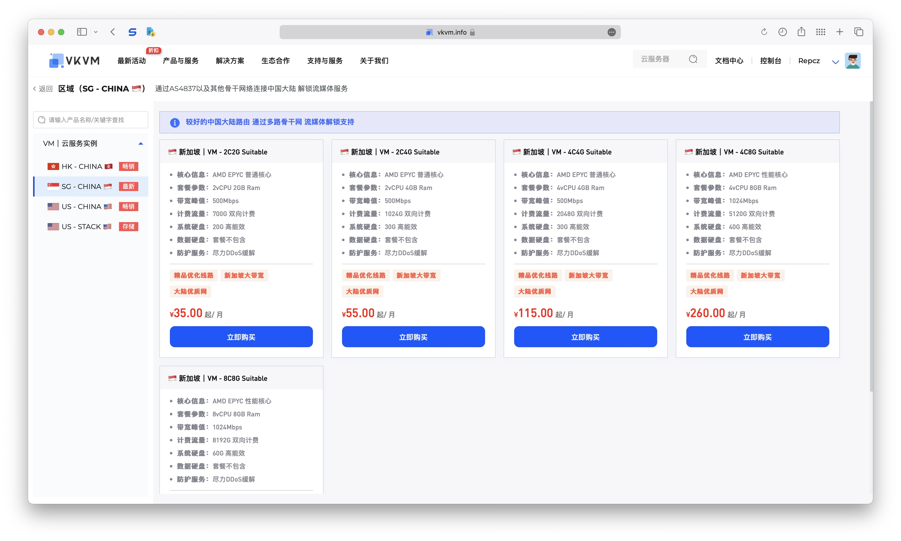

### 官网

https://www.vkvm.info


### 套餐详情

[SG - CHINA 🇸🇬](https://www.vkvm.info/cart?fid=1&gid=6)

此次购买的为 `🇸🇬 新加坡｜VM - 2C2G Suitable 月付`，售价 `24.5 CNY`

```
2 AMD EPYC 7D12 32-Core Processor
2048MB RAM
20GB NVME
1 IPv4 Addresses
4 IPv6 /64 Addresses
1500GB @500Mbps
KVM Virtualization
Singapore, SG Location
Premium Network
Looking glass http://sg-suitable-looking-glass.as215269.info
```



### 回程测试

```
----------------------------------------------------------------------
[NextTrace API] preferred API IP - 172.67.155.192 - 150.90ms - Misaka.HKG
您将默认使用ICMP协议进行路由跟踪，如果您想使用TCP SYN进行路由跟踪，可以加入 -T 参数
『北京 电信 163 AS4134 』
traceroute to ipv4.pek-4134.endpoint.nxtrace.org., 30 hops max, 52 byte packets
1   89.213.49.1     AS215269                  英国    Nasstar
                                              7.38 ms / 5.03 ms / 3.03 ms
2   103.181.12.128  AS51847  [NEAROUTE3-HK]   新加坡    nearoute.io 
                                              0.89 ms / 0.84 ms / 0.72 ms
3   *
4   *
5   *
6   *
7   *
8   *
9   219.158.103.33  AS4837   [CU169-BACKBONE] 中国 广东 广州  chinaunicom.cn  联通
                                              39.56 ms / 43.46 ms / 46.68 ms
10  219.158.103.217 AS4837   [CU169-BACKBONE] 中国 广东 广州  chinaunicom.cn  联通
                                              42.92 ms / 45.43 ms / 43.53 ms
11  *
12  *
13  *
14  *
15  36.110.248.126  AS23724                   中国 北京   bjtelecom.net  电信
                                              285.02 ms / * ms / * ms
16  36.110.251.106  AS23724                   中国 北京   bjtelecom.net 
                                              92.75 ms / 87.38 ms / 87.36 ms
17  220.181.162.162 AS23724  [CHINANET-IDC]   中国 北京 北京  bjtelecom.net 
                                              91.96 ms / 90.71 ms / 88.78 ms
18  220.181.173.35  AS23724  [CHINANET-IDC]   中国 北京 北京  bjtelecom.net 
                                              85.26 ms / 85.26 ms / 85.27 ms

『北京 联通 169 AS4837 』
traceroute to ipv4.pek-4837.endpoint.nxtrace.org., 30 hops max, 52 byte packets
1   89.213.49.1     AS215269                  英国    Nasstar
                                              6.13 ms / 1.23 ms / 6.36 ms
2   103.181.12.128  AS51847  [NEAROUTE3-HK]   新加坡    nearoute.io 
                                              0.53 ms / 0.40 ms / 0.60 ms
3   *
4   *
5   *
6   *
7   *
8   *
9   219.158.20.97   AS4837   [CU169-BACKBONE] 中国 广东 广州  chinaunicom.cn  联通
                                              43.90 ms / 46.66 ms / 42.02 ms
10  219.158.3.213   AS4837   [CU169-BACKBONE] 中国 广东 广州  chinaunicom.cn  联通
                                              44.19 ms / 47.58 ms / 50.42 ms
11  219.158.3.17    AS4837   [CU169-BACKBONE] 中国 广东 广州  chinaunicom.cn  联通
                                              39.84 ms / 40.90 ms / 40.53 ms
12  *
13  *
14  61.148.158.90   AS4808   [UNICOM-CN]      中国 北京   中国联通  联通
                                              71.20 ms / 70.68 ms / 70.74 ms
15  61.135.113.154  AS4808                    中国 北京   中国联通  联通
                                              75.67 ms / 76.32 ms / 75.46 ms
16  *
17  *
18  123.125.96.156  AS4808   [UNICOM-BJ]      中国 北京   中国联通  联通
                                              71.80 ms / 71.50 ms / 71.72 ms

『北京 移动 骨干网 AS9808 』
traceroute to ipv4.pek-9808.endpoint.nxtrace.org., 30 hops max, 52 byte packets
1   89.213.49.1     AS215269                  英国    Nasstar
                                              2.79 ms / 3.86 ms / 5.12 ms
2   103.181.12.128  AS51847  [NEAROUTE3-HK]   新加坡    nearoute.io 
                                              0.55 ms / 3.62 ms / 0.48 ms
3   *
4   *
5   *
6   8.244.8.193     AS3356                    美国    lumen.com 
                                              36.71 ms / 36.93 ms / 36.79 ms
7   4.69.218.150    AS3356                    中国 香港   lumen.com 
    ae4.3602.edge1.HongKong3.level3.net       33.87 ms / 33.90 ms / 34.08 ms
8   4.68.75.242     AS3356                    中国 香港  Level3-CMI-Peer lumen.com 
                                              132.94 ms / * ms / * ms
9   223.120.2.117   AS58453  [CMI-INT]        中国 香港   cmi.chinamobile.com  移动
                                              35.03 ms / 35.54 ms / 35.58 ms
10  223.120.22.142  AS58453  [CMI-INT]        中国 香港   cmi.chinamobile.com  移动
                                              67.21 ms / 67.24 ms / 67.83 ms
11  221.183.55.106  AS9808   [CMNET]          中国 北京  回国到达层 chinamobileltd.com  移动
                                              69.05 ms / 69.02 ms / 69.16 ms
12  221.183.46.250  AS9808   [CMNET]          中国 北京   chinamobileltd.com  移动
                                              78.44 ms / 78.44 ms / 78.26 ms
13  *
14  *
15  *
16  211.136.66.125  AS56048  [CMNET]          中国 北京   bj.10086.cn  移动
                                              84.50 ms / 84.21 ms / 84.33 ms
17  211.136.63.66   AS56048  [CMNET]          中国 北京   bj.10086.cn  移动
                                              84.21 ms / 82.32 ms / 83.44 ms
18  211.136.95.226  AS56048  [CMNET]          中国 北京   bj.10086.cn  移动
                                              80.55 ms / 80.35 ms / 80.24 ms
19  *
20  *
21  211.136.25.153  AS56048  [CMNET]          中国 北京   bj.10086.cn  移动
                                              83.21 ms / 83.33 ms / 83.37 ms

『北京 教育网 CERNET AS4538 』
traceroute to ipv4.pek-4538.endpoint.nxtrace.org., 30 hops max, 52 byte packets
1   89.213.49.1     AS215269                  英国    Nasstar
                                              20.39 ms / 6.96 ms / 1.85 ms
2   103.181.12.128  AS51847  [NEAROUTE3-HK]   新加坡    nearoute.io 
                                              0.82 ms / 0.78 ms / 0.92 ms
3   *
4   *
5   *
6   123.255.91.118  AS4538   [HKIX-HK]        中国 香港  HKIX - CERNET1 - 100Gbps edu.cn 
    multidata1-10g.hkix.net                   38.41 ms / 38.47 ms / 38.39 ms
7   101.4.114.181   AS4538   [BJR-CERNET]     中国 北京 海淀区清华园李兆基科技大楼 CERNET-HKG_BJR edu.cn  教育网
                                              75.20 ms / 75.20 ms / 75.14 ms
8   101.4.114.193   AS4538   [BJR-CERNET]     中国 北京   edu.cn  教育网
                                              276.14 ms / * ms / * ms
9   101.4.117.81    AS4538   [BJR-CERNET]     中国 北京   edu.cn  教育网
                                              172.47 ms / 172.65 ms / * ms
10  101.4.113.201   AS4538   [BJR-CERNET]     中国 北京   edu.cn  教育网
                                              72.96 ms / 76.78 ms / 73.38 ms
11  202.112.38.10   AS4538   [CERNET-CN]      中国 北京   edu.cn  教育网
                                              71.85 ms / 71.94 ms / 71.56 ms
12  118.229.4.74    AS4538   [BJR-CERNET]     中国 北京  海淀区 edu.cn  教育网
                                              75.64 ms / 75.11 ms / 75.42 ms
13  118.229.2.66    AS4538   [BJR-CERNET]     中国 北京  海淀区 edu.cn  教育网
                                              72.21 ms / 72.07 ms / 72.05 ms
14  118.229.8.6     AS4538   [BJR-CERNET]     中国 北京  海淀区 edu.cn  教育网
                                              72.99 ms / 72.28 ms / 72.37 ms
15  *
16  101.6.15.130    AS4538   [BJR-CERNET]     中国 北京  海淀区 edu.cn  教育网
                                              81.11 ms / 81.03 ms / 81.13 ms
----------------------------------------------------------------------
```

### IP质量测试


- IPv4 测试结果

```
########################################################################
                       IP质量体检报告：89.213.*.*
                    bash <(curl -sL IP.Check.Place)
                   https://github.com/xykt/IPQuality
        报告时间：2024-07-30 12:53:49 CST  脚本版本：v2024-07-29
########################################################################
一、基础信息（Maxmind 数据库）
自治系统号：            AS215269
组织：                  Lazycloud Ltd
坐标：                  103°51′21″E, 1°16′56″N
地图：                  https://check.place/1.2823,103.8557,15,cn
城市：                  N/A, 新加坡, 01
使用地：                [SG]新加坡, [AS]亚洲
注册地：                [GB]英国
时区：                  Asia/Singapore
IP类型：                 广播IP 
二、IP类型属性
数据库：      IPinfo    ipregistry    ipapi     AbuseIPDB  IP2LOCATION 
使用类型：     机房        机房        商业        机房        机房    
公司类型：     机房        机房        商业    
三、风险评分
风险等级：      极低         低       中等       高         极高
SCAMALYTICS：  0|低风险
ipapi：    0.00%|极低风险
AbuseIPDB：    0|低风险
IPQS：                        75|可疑IP
DB-IP：         |低风险
四、风险因子
库： IP2LOCATION ipapi ipregistry IPQS SCAMALYTICS ipdata IPinfo IPWHOIS
地区：    [SG]    [SG]    [SG]    [GB]    [SG]    [SG]    [SG]    [GB]
代理：     是      否      否      是      否      是      否      否 
Tor：      否      否      否      否      否      否      否      否 
VPN：      否      否      否      是      否      无      否      否 
服务器：   是      是      是      无      否      否      是      否 
滥用：     否      否      否      否      无      否      无      无 
机器人：   否      否      无      否      否      无      无      无 
五、流媒体及AI服务解锁检测
服务商：  TikTok   Disney+  Netflix Youtube  AmazonPV  Spotify  ChatGPT 
状态：     解锁     解锁     解锁     解锁     解锁     解锁     解锁   
地区：     [GB]     [SG]     [SG]     [SG]     [SG]     [SG]     [US]   
方式：     原生      DNS      DNS     原生      DNS      DNS      DNS   
六、邮局连通性及黑名单检测
本地25端口：阻断
IP地址黑名单数据库：  有效 439   正常 424   已标记 15   黑名单 0
========================================================================
今日IP检测量：142；总检测量：61130。感谢使用xy系列脚本！ 
报告链接：https://Report.Check.Place/IP/VI97H3VNT.svg
```

- IPv6 测试结果

```
########################################################################
                 IP质量体检报告：2407:d840:51:*:*:*:*:*
                    bash <(curl -sL IP.Check.Place)
                   https://github.com/xykt/IPQuality
        报告时间：2024-07-30 12:53:49 CST  脚本版本：v2024-07-29
########################################################################
一、基础信息（Maxmind 数据库）
自治系统号：            AS51847
组织：                  Nearoute Limited
坐标：                  103°48′5″E, 1°22′2″N
地图：                  https://check.place/1.3673,103.8014,13,cn
城市：                  N/A
使用地：                [SG]新加坡, [AS]亚洲
注册地：                [SG]新加坡
时区：                  Asia/Singapore
IP类型：                 原生IP 
二、IP类型属性
数据库：      IPinfo    ipregistry    ipapi     AbuseIPDB  IP2LOCATION 
使用类型：     机房        机房        商业        机房        机房    
公司类型：     机房        机房        商业    
三、风险评分
风险等级：      极低         低       中等       高         极高
SCAMALYTICS：  0|低风险
ipapi：    0.00%|极低风险
AbuseIPDB：    0|低风险
IPQS：                38|低风险
DB-IP：         |低风险
四、风险因子
库： IP2LOCATION ipapi ipregistry IPQS SCAMALYTICS ipdata IPinfo IPWHOIS
地区：    [SG]    [SG]    [SG]    [SG]    [SG]    [SG]    [SG]    [SG]
代理：     否      否      否      否      否      否      否      否 
Tor：      否      否      否      否      否      否      否      否 
VPN：      否      否      否      否      否      无      否      否 
服务器：   是      否      是      无      否      否      是      否 
滥用：     否      否      否      否      无      否      无      无 
机器人：   否      否      无      否      否      无      无      无 
五、流媒体及AI服务解锁检测
服务商：  TikTok   Disney+  Netflix Youtube  AmazonPV  Spotify  ChatGPT 
状态：     失败     失败     失败     解锁     屏蔽     失败     失败   
地区：                                [SG]                              
方式：                                原生                              
六、邮局连通性及黑名单检测
本地25端口：阻断
========================================================================
今日IP检测量：143；总检测量：61131。感谢使用xy系列脚本！ 
报告链接：https://Report.Check.Place/IP/1DQZS6B5V.svg
```

### 融合怪测试

```
--------------------- A Bench Script By spiritlhl ----------------------
                   测评频道: https://t.me/vps_reviews                    
VPS融合怪版本：2024.07.26
Shell项目地址：https://github.com/spiritLHLS/ecs
Go项目地址：https://github.com/oneclickvirt/ecs
---------------------基础信息查询--感谢所有开源项目---------------------
 CPU 型号          : AMD EPYC 7D12 32-Core Processor
 CPU 核心数        : 2
 CPU 频率          : 1097.935 MHz
 CPU 缓存          : L1: 64.00 KB / L2: 1.00 MB / L3: 256.00 MB
 AES-NI指令集      : ✔ Enabled
 VM-x/AMD-V支持    : ✔ Enabled
 内存              : 337.20 MiB / 1.93 GiB
 Swap              : [ no swap partition or swap file detected ]
 硬盘空间          : 2.00 GiB / 19.52 GiB
 启动盘路径        : /dev/vda1
 系统在线时间      : 2 days, 0 hour 35 min
 负载              : 0.39, 0.38, 0.17
 系统              : Debian GNU/Linux 12 (bookworm) (x86_64)
 架构              : x86_64 (64 Bit)
 内核              : 6.8.6
 TCP加速方式       : bbr
 虚拟化架构        : KVM
 NAT类型           : Full Cone
 IPV4 ASN          : AS215269 LAZYCLOUD LTD
 IPV4 位置         : Singapore / Singapore / SG
 IPV6 ASN          : AS51847 Nearoute
 IPV6 位置         : Singapore
 IPV6 子网掩码     : 128
----------------------CPU测试--通过sysbench测试-------------------------
 -> CPU 测试中 (Fast Mode, 1-Pass @ 5sec)
 1 线程测试(单核)得分:          1453 Scores
 2 线程测试(多核)得分:          2907 Scores
---------------------内存测试--感谢lemonbench开源-----------------------
 -> 内存测试 Test (Fast Mode, 1-Pass @ 5sec)
 单线程读测试:          37736.85 MB/s
 单线程写测试:          17157.25 MB/s
------------------磁盘dd读写测试--感谢lemonbench开源--------------------
 -> 磁盘IO测试中 (4K Block/1M Block, Direct Mode)
 测试操作               写速度                                  读速度
 100MB-4K Block         8.3 MB/s (2015 IOPS, 12.70s)            8.2 MB/s (2005 IOPS, 12.76s)
 1GB-1M Block           406 MB/s (388 IOPS, 2.58s)              552 MB/s (525 IOPS, 1.90s)
---------------------磁盘fio读写测试--感谢yabs开源----------------------
Block Size | 4k            (IOPS) | 64k           (IOPS)
  ------   | ---            ----  | ----           ---- 
Read       | 7.98 MB/s     (1.9k) | 128.04 MB/s   (2.0k)
Write      | 8.01 MB/s     (2.0k) | 128.72 MB/s   (2.0k)
Total      | 16.00 MB/s    (4.0k) | 256.76 MB/s   (4.0k)
           |                      |                     
Block Size | 512k          (IOPS) | 1m            (IOPS)
  ------   | ---            ----  | ----           ---- 
Read       | 498.38 MB/s    (973) | 492.25 MB/s    (480)
Write      | 524.86 MB/s   (1.0k) | 525.03 MB/s    (512)
Total      | 1.02 GB/s     (1.9k) | 1.01 GB/s      (992)
------------流媒体解锁--基于oneclickvirt/CommonMediaTests开源-----------
以下测试的解锁地区是准确的，但是不是完整解锁的判断可能有误，这方面仅作参考使用
----------------Netflix-----------------
[IPV4]
您的出口IP完整解锁Netflix，支持非自制剧的观看
NF所识别的IP地域信息：新加坡
[IPV6]
您的网络可能没有正常配置IPv6，或者没有IPv6网络接入
----------------Youtube-----------------
[IPV4]
连接方式: Youtube Video Server
视频缓存节点地域: 新加坡 新加坡/樟宜  (SIN11S18)
Youtube识别地域: 新加坡(SG)
[IPV6]
连接方式: Youtube Video Server
视频缓存节点地域: 新加坡 新加坡/樟宜  (SIN11S18)
Youtube识别地域: 新加坡(SG)
---------------DisneyPlus---------------
[IPV4]
当前出口所在地区解锁DisneyPlus
区域：SG 区
[IPV6]
当前出口所在地区解锁DisneyPlus
区域：SG 区
解锁Netflix，Youtube，DisneyPlus上面和下面进行比较，不同之处自行判断
----------------流媒体解锁--感谢RegionRestrictionCheck开源--------------
 以下为IPV4网络测试，若无IPV4网络则无输出
============[ Multination ]============
 Dazn:                                  Yes (Region: SG)
 Disney+:                               Yes (Region: SG)
 Netflix:                               Yes (Region: SG)
 YouTube Premium:                       Yes (Region: SG)
 Amazon Prime Video:                    Yes (Region: SG)
 TVBAnywhere+:                          Yes
 Spotify Registration:                  Yes (Region: SG)
 Instagram Licensed Audio:              No
 OneTrust Region:                       SG [Unknown]
 iQyi Oversea Region:                   GB
 Bing Region:                           SG
 YouTube CDN:                           Singapore
 Netflix Preferred CDN:                 [OVH] in [Singapore]
 ChatGPT:                               Yes
 Google Gemini:                         Yes (Region: USA)
 Wikipedia Editability:                 Yes
 Google Search CAPTCHA Free:            Yes
 Steam Currency:                        SGD
 ---Forum---
 Reddit:                                Yes
=======================================
 以下为IPV6网络测试，若无IPV6网络则无输出
============[ Multination ]============
 Dazn:                                  IPv6 Is Not Currently Supported
 Disney+:                               IPv6 Is Not Currently Supported
 Netflix:                               Failed (Network Connection)
 YouTube Premium:                       Yes (Region: SG)
 Amazon Prime Video:                    IPv6 Is Not Currently Supported
 TVBAnywhere+:                          IPv6 Is Not Currently Supported
 Spotify Registration:                  Failed (Network Connection)
 Instagram Licensed Audio:              No
 OneTrust Region:                       Failed (Network Connection)
 iQyi Oversea Region:                   IPv6 Is Not Currently Supported
 Bing Region:                           SG
 YouTube CDN:                           Singapore
 Netflix Preferred CDN:                 Failed (CDN IP Not Found)
 ChatGPT:                               Failed (Network Connection)
 Google Gemini:                         No
 Wikipedia Editability:                 No
 Google Search CAPTCHA Free:            No
 Steam Currency:                        IPv6 Is Not Currently Supported
 ---Forum---
 Reddit:                                IPv6 Is Not Currently Supported
=======================================
---------------TikTok解锁--感谢lmc999的源脚本及fscarmen PR--------------
 Tiktok Region:         【GB】
-------------IP质量检测--基于oneclickvirt/securityCheck使用-------------
数据仅作参考，不代表100%准确，如果和实际情况不一致请手动查询多个数据库比对
以下为各数据库编号，输出结果后将自带数据库来源对应的编号
ipinfo数据库  [0] | scamalytics数据库 [1] | virustotal数据库   [2] | abuseipdb数据库   [3] | ip2location数据库    [4]
ip-api数据库  [5] | ipwhois数据库     [6] | ipregistry数据库   [7] | ipdata数据库      [8] | db-ip数据库          [9]
ipapiis数据库 [A] | ipapicom数据库    [B] | bigdatacloud数据库 [C] | cheervision数据库 [D] | ipqualityscore数据库 [E]
IPV4:
安全得分:
声誉(越高越好): 0 [2] 
信任得分(越高越好): 6 [8] 
VPN得分(越低越好): 98 [8] 
代理得分(越低越好): 100 [8]
社区投票-无害: 0 [2] 
社区投票-恶意: 0 [2] 
威胁得分(越低越好): 84 [8] 
欺诈得分(越低越好): 65 [E] 0 [1]
滥用得分(越低越好): 0 [3] 
ASN滥用得分(越低越好): 0 (Very Low) [A]
公司滥用得分(越低越好): 0 (Very Low) [A] 
威胁级别: low [9 B] 
黑名单记录统计:(有多少黑名单网站有记录):
无害记录数: 0 [2]  恶意记录数: 0 [2]  可疑记录数: 0 [2]  无记录数: 93 [2]  
安全信息:
使用类型: unknown [C] DataCenter/WebHosting/Transit [3] hosting [0 7 9] business [8 A]
公司类型: hosting [0] business [7 A]
是否云提供商: Yes [7 D] 
是否数据中心: Yes [0 A] No [1 5 6 8 C]
是否移动设备: Yes [E] No [5 A C]
是否代理: No [0 6 7 9 A B C D] Yes [1 4 5 8 E]
是否VPN: Yes [E] No [0 1 6 7 A C D]
是否TorExit: No [1 7 D] 
是否Tor出口: No [1 7 D] 
是否网络爬虫: No [9 A B E] 
是否匿名: No [1 6 7 D] Yes [8]
是否攻击者: No [7 8 D] 
是否滥用者: No [7 8 A C D E] 
是否威胁: No [7 8 C D] 
是否中继: No [0 7 8 C D] 
是否Bogon: No [7 8 A C D] 
是否机器人: No [E] 
DNS-黑名单: 310(Total_Check) 0(Clean) 4(Blacklisted) 19(Other) 
IPV6:
安全得分:
欺诈得分(越低越好): 0 [1] 
滥用得分(越低越好): 0 [3]
ASN滥用得分(越低越好): 0.001 (Low) [A] 
公司滥用得分(越低越好): 0 (Very Low) [A] 
威胁级别: low [B] 
安全信息:
使用类型: business [A] DataCenter/WebHosting/Transit [3]
公司类型: business [A] 
是否云提供商: Yes [D] 
是否数据中心: Yes [1] No [A]
是否移动设备: No [A] 
是否代理: No [1 A B D] 
是否VPN: No [1 A D] 
是否Tor: No [1 3 A B D] 
是否Tor出口: No [1 D] 
是否网络爬虫: No [A B] 
是否匿名: No [1 D] 
是否攻击者: No [D] 
是否滥用者: No [A D] 
是否威胁: No [D] 
是否中继: No [D] 
是否Bogon: No [A D] 
DNS-黑名单: 310(Total_Check) 0(Clean) 0(Blacklisted) 310(Other) 
Google搜索可行性：NO
-------------邮件端口检测--基于oneclickvirt/portchecker开源-------------
Platform  SMTP  SMTPS POP3  POP3S IMAP  IMAPS
LocalPort ✔     ✔     ✔     ✔     ✔     ✔    
QQ        ✔     ✔     ✔     ✘     ✔     ✘    
163       ✔     ✔     ✔     ✘     ✔     ✘    
Sohu      ✔     ✔     ✔     ✘     ✔     ✘    
Yandex    ✔     ✔     ✔     ✘     ✔     ✘    
Gmail     ✔     ✔     ✘     ✘     ✘     ✘    
Outlook   ✔     ✘     ✔     ✘     ✔     ✘    
Office365 ✔     ✘     ✔     ✘     ✔     ✘    
Yahoo     ✔     ✔     ✘     ✘     ✘     ✘    
MailCOM   ✔     ✔     ✔     ✘     ✔     ✘    
MailRU    ✔     ✔     ✘     ✘     ✘     ✘    
AOL       ✔     ✔     ✘     ✘     ✘     ✘    
GMX       ✔     ✘     ✔     ✘     ✔     ✘    
Sina      ✔     ✘     ✔     ✘     ✔     ✘    
----------------三网回程--基于oneclickvirt/backtrace开源----------------
北京电信 219.141.140.10  联通4837   [普通线路] 电信163    [普通线路] 
北京联通 202.106.195.68  联通4837   [普通线路] 
北京移动 221.179.155.161 移动CMI    [普通线路] 
上海电信 202.96.209.133  联通4837   [普通线路] 电信163    [普通线路] 
上海联通 210.22.97.1     联通4837   [普通线路] 
上海移动 211.136.112.200 移动CMI    [普通线路] 
广州电信 58.60.188.222   联通4837   [普通线路] 
广州联通 210.21.196.6    联通4837   [普通线路] 
广州移动 120.196.165.24  移动CMI    [普通线路] 
成都电信 61.139.2.69     联通4837   [普通线路] 
成都联通 119.6.6.6       联通4837   [普通线路] 
成都移动 211.137.96.205  移动CMI    [普通线路] 
准确线路自行查看详细路由，本测试结果仅作参考
同一目标地址多个线路时，可能检测已越过汇聚层，除了第一个线路外，后续信息可能无效
---------------------回程路由--感谢fscarmen开源及PR---------------------
依次测试电信/联通/移动经过的地区及线路，核心程序来自ipip.net或nexttrace，请知悉!
广州电信 58.60.188.222
7.54 ms  AS215269  新加坡, nasstar.com
0.77 ms  *  中国, 香港, nearoute.io
42.61 ms  AS4837  中国, 广东, 广州, chinaunicom.com, 联通
44.15 ms  AS4134  中国, 广东, 深圳, chinatelecom.com.cn, 电信
44.21 ms  AS4134  中国, 广东, 深圳, chinatelecom.com.cn, 电信
广州联通 210.21.196.6
1.58 ms  AS215269  新加坡, nasstar.com
0.44 ms  *  中国, 香港, nearoute.io
45.64 ms  AS4837  中国, 广东, 广州, chinaunicom.com, 联通
48.11 ms  AS4837  中国, 广东, 广州, chinaunicom.com, 联通
42.96 ms  AS4837  中国, 广东, 广州, chinaunicom.com, 联通
40.56 ms  AS17816  中国, 广东, 深圳, chinaunicom.com, 联通
44.93 ms  AS17623  中国, 广东, 深圳, chinaunicom.com, 联通
42.17 ms  AS17623  中国, 广东, 深圳, chinaunicom.com, 联通
广州移动 120.196.165.24
5.00 ms  AS215269  新加坡, nasstar.com
0.91 ms  *  中国, 香港, nearoute.io
36.76 ms  AS3356  中国, 香港, level3.com
34.90 ms  AS3356  中国, 香港, level3.com
35.71 ms  AS58453  中国, 香港, chinamobile.com, 移动
36.67 ms  AS58453  中国, 香港, chinamobile.com, 移动
42.68 ms  AS58453  中国, 广东, 广州, chinamobile.com, 移动
66.27 ms  AS9808  中国, 广东, 广州, chinamobile.com, 移动
43.12 ms  AS9808  中国, 广东, 广州, chinamobile.com, 移动
45.21 ms  AS9808  中国, 广东, 广州, chinamobile.com, 移动
44.23 ms  AS56040  中国, 广东, 深圳, chinamobile.com, 移动
--------------------自动更新测速节点列表--本脚本原创--------------------
位置             上传速度        下载速度        延迟     丢包率
Speedtest.net    475.09 Mbps     477.94 Mbps              NULL
新加坡           466.95 Mbps     5910.01 Mbps             0.0%
中国香港         117.48 Mbps     3387.19 Mbps             0.0%
联通WuXi         469.12 Mbps     472.11 Mbps              0.0%
电信浙江         444.47 Mbps     485.99 Mbps              NULL
------------------------------------------------------------------------
 总共花费      : 5 分 49 秒
 时间          : Tue Jul 30 13:03:04 CST 2024
------------------------------------------------------------------------
  短链:
    http://hpaste.spiritlhl.net/u/Zht1Qk.txt
```